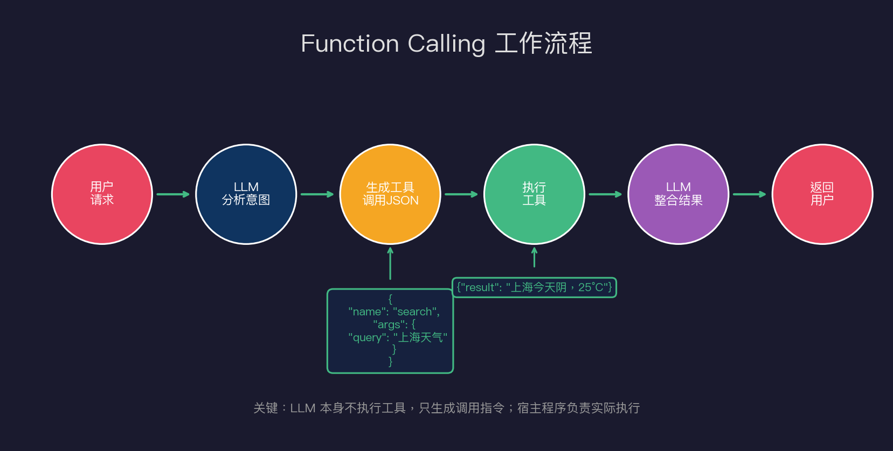
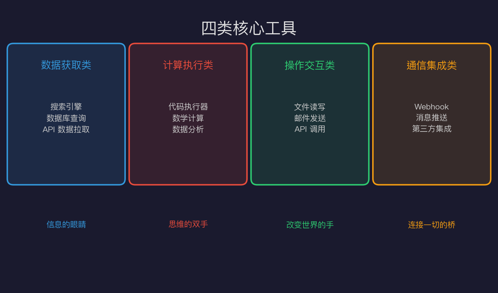
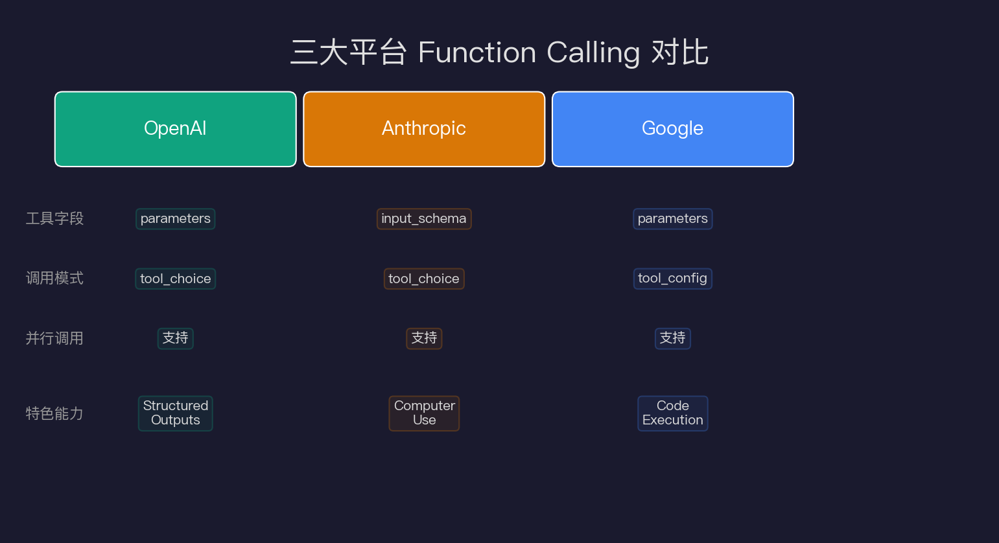
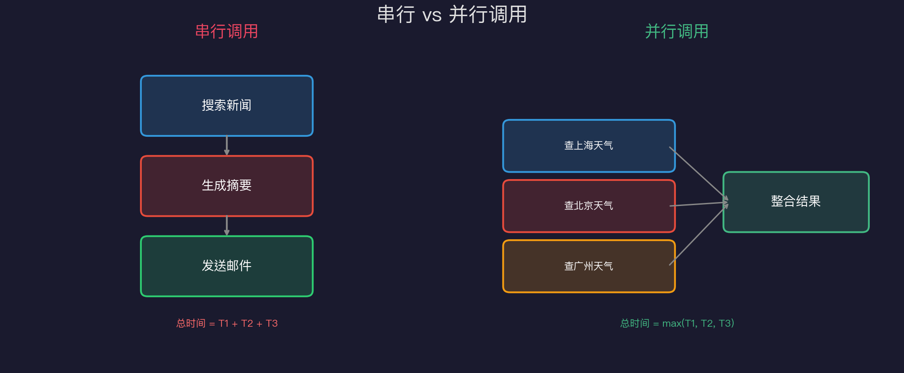
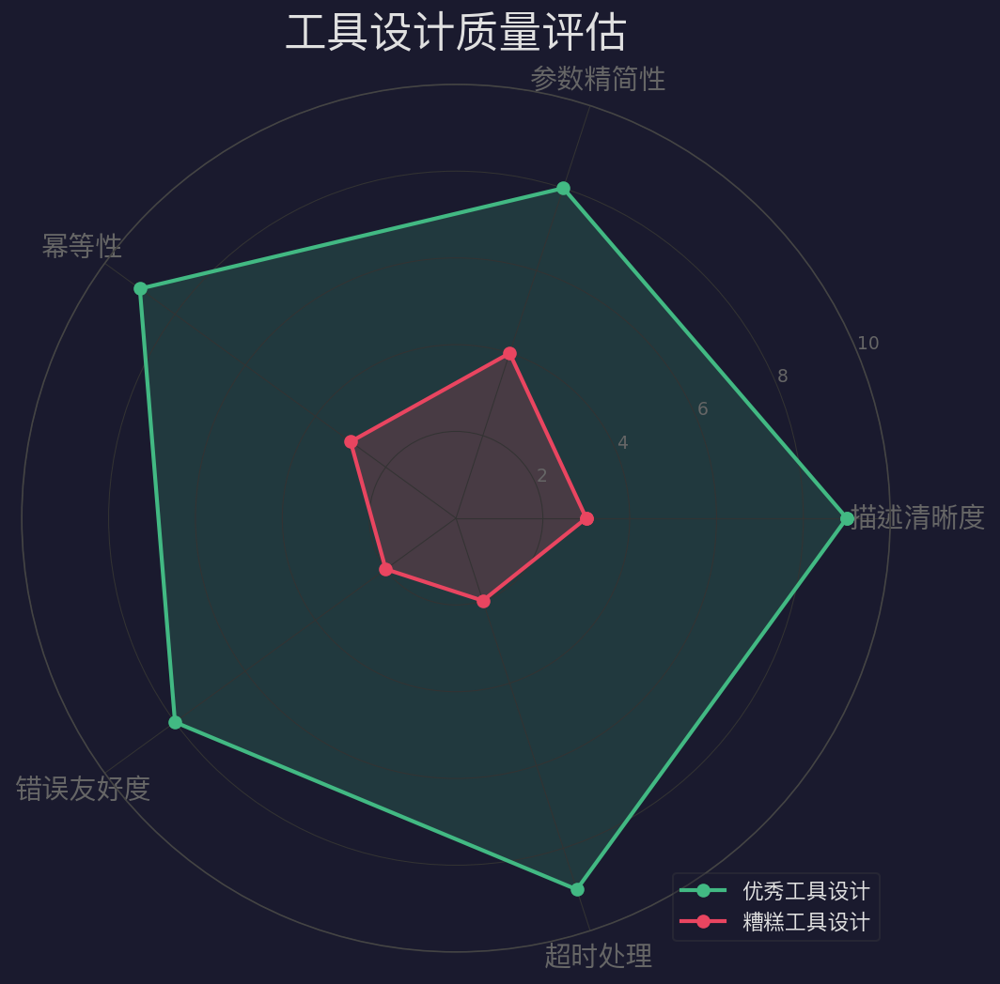

# Tool Use：Agent的手和脚

> 一个没有工具的 Agent，就像一个困在玻璃箱里的天才——看得见外面的世界，却什么都做不了。

## LLM 的能力边界：为什么需要工具？

在深入讲解 Function Calling 之前，我们先聊一个最基础的问题：大语言模型（LLM）到底能做什么，不能做什么？

LLM 本质上是一个**文本预测机器**。给它一段文字，它根据训练数据中的统计规律，输出最可能的下一个 token。它的能力令人惊叹——推理、写作、翻译、代码生成……但它有几条铁的边界：

**1. 无法访问实时数据**

LLM 有个训练截止日期。问它"今天比特币多少钱"，它只能说"我的知识截止于 2024 年 X 月"。这不是在卖关子——它真的不知道。

**2. 无法执行代码**

LLM 可以写出完美的 Python 代码，但它自己跑不了。它只能预测代码"看起来对不对"，而不知道运行结果。问它"1023 + 4579 的平方根是多少"，它可能给出一个听起来合理但完全错误的数字。（这不是笑话，LLM 算术确实很差。）

**3. 无法持久化操作**

它不能发邮件、不能写文件、不能调用 API。它只能**描述**这些操作，而不能**执行**它们。

**4. 无法感知外部世界**

没有眼睛、没有耳朵——它只有输入给它的文字。摄像头看到什么、传感器测到什么，和它没有直接关系。

**工具（Tool Use）就是打破这四道墙的锤子。**

通过给 LLM 配备工具，它能够：
- 调用搜索 API 获取实时数据
- 启动代码解释器执行计算
- 写文件、发消息、操作数据库
- 感知外部环境（通过传感器 API）

这就是为什么 Agent = LLM + Tools + Memory + Planning。工具是 Agent 伸向外部世界的手和脚。

## Function Calling 机制原理

Function Calling（也叫 Tool Use）是目前最主流的工具调用机制。理解它的关键是：**LLM 本身不执行任何工具，它只生成"调用指令"**。

让我们用一个具体例子走完整个流程：

```
用户：上海今天天气怎么样？
```



**第一步：LLM 分析意图**

LLM 收到问题，结合工具定义（开发者预先提供的 JSON Schema），判断需要调用天气工具。

**第二步：生成工具调用 JSON**

LLM 输出的不是直接回答，而是一段结构化的工具调用指令：

```json
{
  "tool_calls": [{
    "id": "call_abc123",
    "type": "function",
    "function": {
      "name": "get_weather",
      "arguments": "{\"city\": \"上海\", \"date\": \"today\"}"
    }
  }]
}
```

**第三步：宿主程序执行工具**

应用程序（不是 LLM！）解析这段 JSON，实际调用天气 API：

```python
result = weather_api.get(city="上海", date="today")
# 返回: {"temperature": 22, "weather": "阴", "humidity": 78}
```

**第四步：LLM 整合结果**

把工具执行结果塞回对话，LLM 生成最终回答：

```
上海今天天气阴，气温 22°C，湿度 78%。出门建议带把伞。
```

整个过程有个关键洞见：**LLM 是大脑，工具是手脚，宿主程序是中枢神经系统**。这三者缺一不可。

## 工具定义：JSON Schema 的艺术

工具调用的质量，80% 取决于工具定义的质量。一个写得好的工具描述，能让 LLM 准确调用；写得差的，就是让 LLM 瞎猜。

以一个搜索工具为例：

```json
{
  "name": "web_search",
  "description": "在互联网上搜索实时信息。适用于：需要最新新闻、当前价格、实时数据的场景。不适用于：静态知识问答（直接用LLM回答更好）。",
  "parameters": {
    "type": "object",
    "properties": {
      "query": {
        "type": "string",
        "description": "搜索关键词。请使用简洁、精确的中英文关键词，避免用完整句子。例如：'上海 天气 今天' 而非 '上海今天的天气情况如何'"
      },
      "num_results": {
        "type": "integer",
        "description": "返回结果数量，默认3，最大10",
        "default": 3,
        "minimum": 1,
        "maximum": 10
      }
    },
    "required": ["query"]
  }
}
```

注意几个细节：
- `description` 不只是说"是什么"，还说了"什么时候用/不用"——这极大减少误调用
- `query` 的描述里给了具体例子，教 LLM 如何构造好的查询
- `num_results` 有默认值和范围约束——防御性设计



## 四类核心工具深度解析

### 数据获取类：信息的眼睛

这类工具让 Agent 能看见外部世界的实时状态。

**搜索工具**是最基础的数据获取工具：

```python
@tool
def web_search(query: str, num_results: int = 3) -> list[dict]:
    """搜索互联网获取实时信息"""
    results = brave_search_api.search(query, count=num_results)
    return [{"title": r.title, "url": r.url, "snippet": r.description} 
            for r in results]
```

**设计要点**：
- 返回结构化数据，不要返回原始 HTML
- 包含 URL，让 LLM 能进一步抓取详情
- 适当截断内容，避免上下文窗口爆炸

**数据库查询工具**在企业场景极常见：

```python
@tool
def query_database(sql: str, database: str = "production") -> dict:
    """执行SQL查询。只支持SELECT语句，禁止修改操作。"""
    if not sql.strip().upper().startswith("SELECT"):
        raise ValueError("只允许SELECT查询")
    with get_connection(database) as conn:
        result = conn.execute(sql)
        return {"rows": result.fetchall(), "columns": result.keys()}
```

**关键设计**：显式禁止危险操作，在工具层做安全防护，而不是信任 LLM 的自制力。

### 计算执行类：思维的双手

**代码执行器**是最强大也最危险的工具：

```python
@tool
def execute_python(code: str, timeout: int = 30) -> dict:
    """在安全沙箱中执行Python代码，返回输出和执行状态"""
    sandbox = DockerSandbox(image="python:3.11-slim", 
                           network_disabled=True,
                           memory_limit="256m")
    try:
        result = sandbox.run(code, timeout=timeout)
        return {"stdout": result.stdout, "stderr": result.stderr, 
                "exit_code": result.exit_code}
    except TimeoutError:
        return {"error": f"执行超时（{timeout}秒）", "exit_code": -1}
```

**安全原则**：代码执行必须在沙箱环境中，禁止网络访问，限制内存和时间。这不是可选项，是必选项。

### 操作交互类：改变世界的手

文件操作工具是幂等性设计的好例子：

```python
@tool
def write_file(path: str, content: str, mode: str = "write") -> dict:
    """写入文件。mode='write'覆盖写，mode='append'追加写。"""
    allowed_dirs = ["/workspace", "/tmp/agent"]
    if not any(path.startswith(d) for d in allowed_dirs):
        raise PermissionError(f"不允许写入路径: {path}")
    
    with open(path, 'w' if mode == 'write' else 'a') as f:
        f.write(content)
    return {"success": True, "path": path, "bytes_written": len(content)}
```

**设计亮点**：路径白名单防止目录遍历攻击；`mode` 参数明确区分覆盖和追加，避免意外数据丢失。

### 通信集成类：连接一切的桥梁

API 调用工具在企业集成中最常见：

```python
@tool  
def call_rest_api(
    url: str, 
    method: str = "GET",
    headers: dict = None,
    body: dict = None,
    timeout: int = 30
) -> dict:
    """调用REST API。支持GET/POST/PUT/DELETE。"""
    import requests
    resp = requests.request(
        method=method.upper(),
        url=url,
        headers=headers or {},
        json=body,
        timeout=timeout
    )
    return {
        "status_code": resp.status_code,
        "body": resp.json() if resp.headers.get('content-type', '').startswith('application/json') else resp.text,
        "success": resp.ok
    }
```

## 三大平台对比：OpenAI vs Anthropic vs Google



三大平台的 Function Calling 在概念上完全相同，但 API 格式略有差异。

**OpenAI 格式**：
```python
response = client.chat.completions.create(
    model="gpt-4o",
    tools=[{
        "type": "function",
        "function": {
            "name": "get_weather",
            "description": "获取城市天气",
            "parameters": {
                "type": "object",
                "properties": {"city": {"type": "string"}},
                "required": ["city"]
            }
        }
    }],
    tool_choice="auto"  # 让模型决定是否调用
)
```

**Anthropic 格式**：
```python
response = anthropic.messages.create(
    model="claude-opus-4-5",
    tools=[{
        "name": "get_weather",
        "description": "获取城市天气",
        "input_schema": {  # 注意：是 input_schema，不是 parameters
            "type": "object",
            "properties": {"city": {"type": "string"}},
            "required": ["city"]
        }
    }]
)
```

**主要差异**：
- OpenAI 叫 `parameters`，Anthropic 叫 `input_schema`
- OpenAI 用 `tool_choice` 控制调用策略，Anthropic 用 `tool_choice`（格式略不同）
- Anthropic 有独特的 `computer_use` 内置工具（控制电脑）
- Google 最接近 OpenAPI 标准，企业集成友好

选择哪个平台？**用什么模型就用什么格式**，或者用 LangChain/LlamaIndex 做抽象层屏蔽差异。

## 工具编排：串行、并行、条件

真实场景往往需要多个工具协作。编排策略直接影响效率。



**串行调用（Sequential）**

适合有依赖关系的场景：

```
用户："帮我分析最近的 AI 新闻，然后总结成中文摘要，发到我的邮箱"
步骤：
1. search("AI news latest") → 获取新闻
2. summarize(news) → 生成摘要（依赖步骤1）
3. send_email(summary) → 发送邮件（依赖步骤2）
```

**并行调用（Parallel）**

适合独立任务，效率提升显著：

```
用户："比较上海、北京、广州今天的天气"
步骤：同时调用
  get_weather("上海") ─┐
  get_weather("北京") ─┼→ 整合结果 → 生成对比报告
  get_weather("广州") ─┘
```

时间从 3 × T 缩短到 1 × T，对实时性要求高的场景价值巨大。

**条件调用（Conditional）**

根据前一步结果决定下一步：

```python
# 伪代码
result = search(query)
if result.confidence < 0.8:
    # 搜索结果不够好，换个策略
    result = search(query + " site:wikipedia.org")
    
if result.needs_calculation:
    calc_result = execute_python(result.formula)
```

这种模式在复杂 Agent 中非常常见，是 ReAct（Reasoning + Acting）框架的核心。

## 工具设计的五大原则



**原则一：描述胜过命名**

工具名字不重要，描述最重要。LLM 通过阅读 description 来决定何时调用工具。

❌ 差：`description: "搜索工具"`  
✅ 好：`description: "在互联网实时搜索信息，适合需要当前数据的场景；对于常识性问题请直接回答，无需调用此工具"`

**原则二：参数宁少勿多**

每多一个参数，LLM 填错的概率就提升一倍。把复杂参数折叠到一个 JSON 字符串，或者设计多个简单工具，而不是一个复杂工具。

**原则三：幂等性优先**

`read_file` 天然幂等，调用多次结果相同。`delete_file` 不幂等——调用两次第二次会报错。对于非幂等操作，工具内部要做去重检查。

**原则四：错误要有意义**

```python
# ❌ 差
raise Exception("Error")

# ✅ 好  
raise ValueError(f"参数 'city' 不能为空。请提供城市名，如 '上海' 或 'Shanghai'")
```

LLM 会把错误信息读回去，决定怎么重试。有意义的错误信息 = 更好的自动恢复能力。

**原则五：超时必须处理**

任何网络调用都可能卡死。没有超时的工具会让整个 Agent 永远等待：

```python
try:
    result = external_api.call(timeout=30)
except TimeoutError:
    return {"error": "服务超时（30秒），请稍后重试或尝试其他方式"}
```

## 常见陷阱与防坑指南

**陷阱一：工具描述"太聪明"**

有些开发者会写复杂的描述试图"引导"LLM 的行为，结果反而让 LLM 困惑。工具描述要直接、明确，不要试图预测 LLM 的行为。

**陷阱二：参数校验缺失**

永远不要相信 LLM 生成的参数合法：

```python
@tool
def send_email(to: str, subject: str, body: str) -> dict:
    # ❌ 直接使用，可能注入攻击或格式错误
    
    # ✅ 先校验
    import re
    if not re.match(r'^[^@]+@[^@]+\.[^@]+$', to):
        raise ValueError(f"无效的邮箱地址: {to}")
    if len(subject) > 200:
        raise ValueError("标题太长（最大200字符）")
```

**陷阱三：工具爆炸**

有些项目把所有功能都做成工具，结果工具列表有几十个。LLM 处理太多工具时会迷失——它不知道该用哪个。

**最佳实践**：保持工具数量 ≤ 20，用工具的 `description` 做好分类说明，或者实现"工具路由"（先让 LLM 选工具集，再从小工具集选具体工具）。

**陷阱四：循环调用**

Agent 可能陷入循环：A 工具触发 B 工具，B 工具又触发 A 工具。设置最大调用次数（max_iterations），防止无限循环：

```python
MAX_TOOL_CALLS = 20
tool_call_count = 0

while True:
    response = llm.call(messages)
    if not response.tool_calls:
        break
    tool_call_count += len(response.tool_calls)
    if tool_call_count > MAX_TOOL_CALLS:
        raise RuntimeError("工具调用次数超限，可能存在循环")
```

## 从工具调用到真正的 Agent

工具调用是 Agent 能力的基础，但不是全部。一个真正有用的 Agent 需要：

- **工具（Tool Use）**：能做什么
- **记忆（Memory）**：记住了什么
- **规划（Planning）**：怎么做

这三者缺一不可。工具让 Agent 有了手脚，记忆让它不会失忆，规划让它能完成复杂任务。

后续几篇文章会分别深入这些主题。但现在，你已经理解了最关键的部分：**LLM 是大脑，工具是接口，而你——开发者——是设计这个系统的架构师**。

工具设计得好，Agent 就像得心应手的助手；工具设计得差，再强大的 LLM 也会在错误的工具调用中迷失。

## 参考资料

- [OpenAI Function Calling 官方文档](https://platform.openai.com/docs/guides/function-calling)
- [Anthropic Tool Use 指南](https://docs.anthropic.com/claude/docs/tool-use)
- [Google Gemini Function Calling](https://ai.google.dev/docs/function_calling)
- [LangChain Tools 文档](https://python.langchain.com/docs/modules/agents/tools/)
- [ReAct: Synergizing Reasoning and Acting in Language Models](https://arxiv.org/abs/2210.03629)
- [Toolformer: Language Models Can Teach Themselves to Use Tools](https://arxiv.org/abs/2302.04761)
