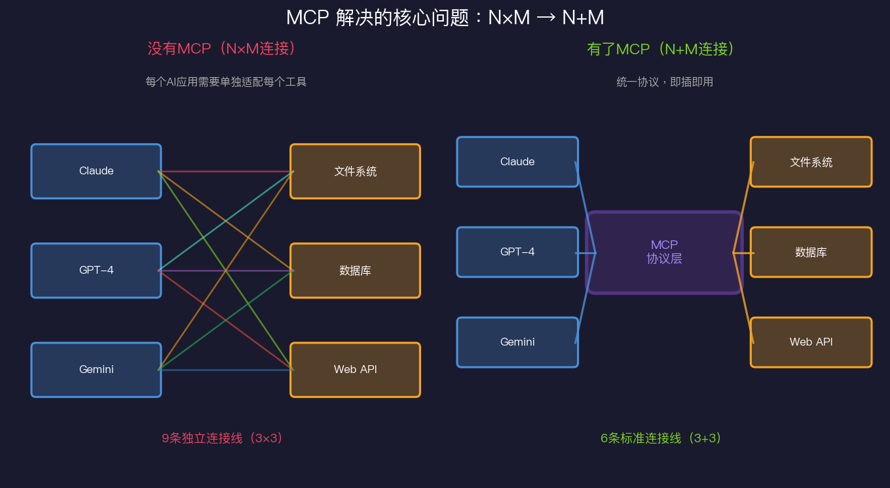
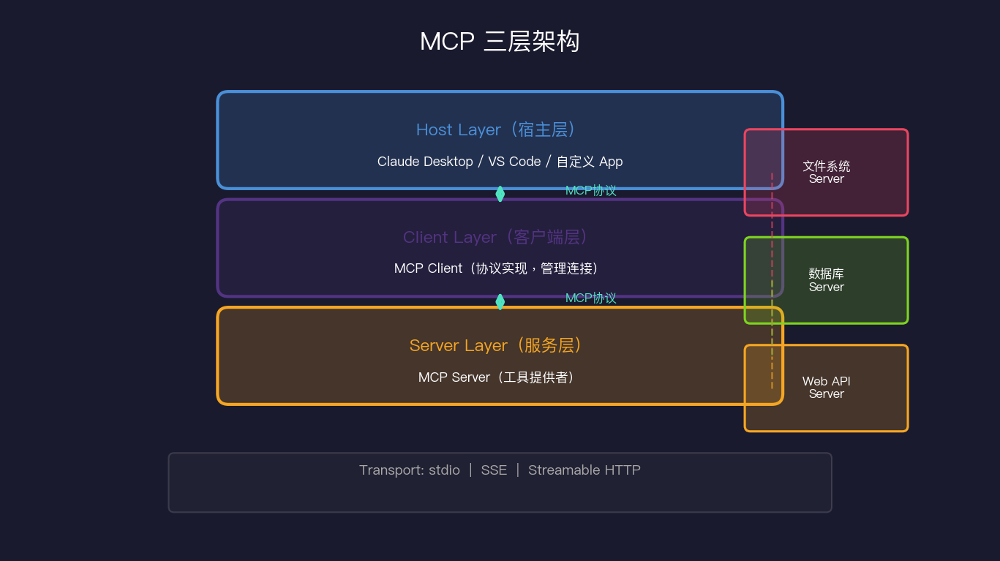
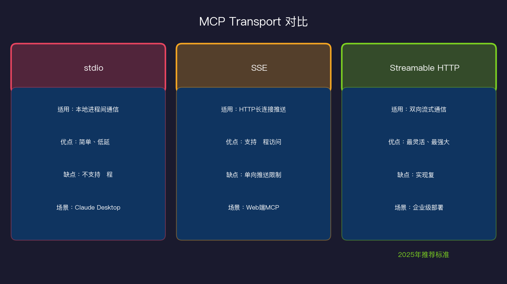
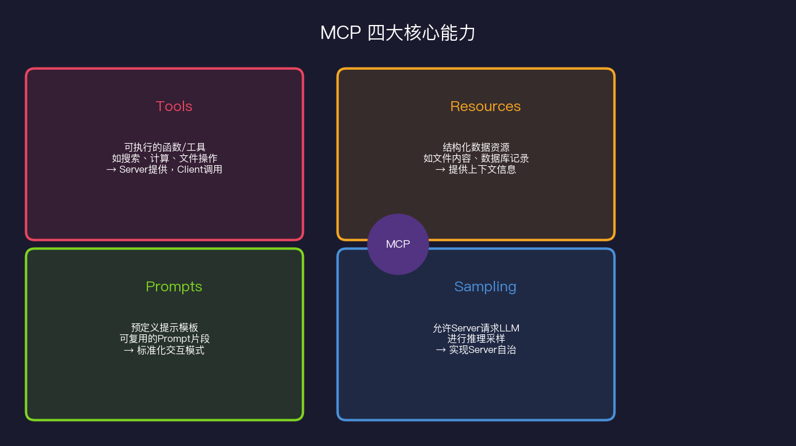

# MCP协议：Agent工具调用的USB标准

> 在 MCP 出现之前，每个 AI 应用都要自己写工具适配器。这就像每家电器厂商都发明自己的插头标准——绝大多数精力浪费在重复造轮子上。

## 一个让所有人都头疼的问题

2024 年以前，如果你要构建一个能使用工具的 AI 应用，大概会经历这样的噩梦：

你用 Claude 写了一个助手，想让它访问公司的数据库。你花了一周写了 Claude 的数据库连接器。

然后产品经理说："能不能也支持 GPT-4？"

你又花一周写了 GPT-4 的连接器。

然后有人说："我们还有个 Slack 工具、一个 GitHub 集成、一个 Jira 连接……"

乘以三个 AI 平台……这就是 **N×M 问题**：N 个 AI 应用，M 个工具，需要 N×M 个适配器。

这个问题不是个例——它是整个行业的痛点。Anthropic 在 2024 年 11 月发布了 MCP（Model Context Protocol，模型上下文协议），一举将 N×M 变成了 N+M。

## MCP 是什么：AI 界的 USB

USB 出现之前，每种设备有自己的接口——打印机用并口，鼠标用 PS/2，音箱用 3.5mm……USB 统一了标准，让"即插即用"成为现实。

MCP 想做的是同一件事：**统一 AI 与工具之间的通信协议**。



有了 MCP：
- **工具开发者**只需实现一次 MCP Server
- **AI 应用开发者**只需集成一次 MCP Client
- **两者自动对接**，就像 USB 设备和 USB 口

这不只是工程上的整洁，它改变了生态的激励结构：工具开发者愿意投资做好的 MCP Server，因为它能被所有 AI 应用使用，而不是只服务某一家。

## MCP 三层架构详解

MCP 定义了三个角色：



### Host（宿主）

Host 是用户直接使用的 AI 应用。例如：
- **Claude Desktop**：Anthropic 的桌面客户端
- **VS Code + Continue**：支持 MCP 的代码编辑器插件
- **Cursor**：AI 编程工具
- **你自己开发的应用**：任何集成了 MCP Client 的程序

Host 的职责是管理 MCP Client 的生命周期，处理用户交互，协调 LLM 与工具之间的对话。

### Client（客户端）

Client 是协议的实现层。每个 Host 内部维护一个或多个 MCP Client，每个 Client 对应一个 MCP Server 连接。

Client 负责：
- 与 Server 建立连接（通过 Transport）
- 发送协议请求（initialize, list_tools, call_tool 等）
- 处理 Server 的响应和通知

通常你不需要直接实现 Client——使用官方 SDK 即可。

### Server（服务器）

Server 是工具的提供者。它暴露工具、资源、提示模板等能力，供 Client 调用。

一个典型的 MCP Server 可能提供：
- 文件系统访问（读写文件、列目录）
- 数据库查询（SQL 执行）
- Web 搜索
- GitHub 操作
- 任何你能想到的功能

**关键洞察**：Server 完全独立于 LLM。同一个"文件系统 MCP Server"可以被 Claude、GPT-4、Gemini 共用——因为协议是统一的。

## Transport 层：连接的物理介质

MCP 支持三种传输方式，适合不同部署场景：



### stdio（标准输入输出）

最简单的方式。Host 把 Server 作为子进程启动，通过 stdin/stdout 通信：

```python
# 启动方式（Claude Desktop 配置）
{
  "mcpServers": {
    "filesystem": {
      "command": "npx",
      "args": ["-y", "@modelcontextprotocol/server-filesystem", "/Users/me/projects"]
    }
  }
}
```

**优点**：零配置，延迟极低，安全性好（进程隔离）  
**缺点**：只能本地使用，无法远程访问

### SSE（Server-Sent Events）

通过 HTTP 实现服务端推送：

```
Client → HTTP POST /message → Server（发送请求）
Server → SSE /sse → Client（接收响应和通知）
```

**优点**：支持远程访问，可以在云端部署  
**缺点**：单向推送机制，实现相对复杂

### Streamable HTTP（2025 年新标准）

MCP 在 2025 年将 Streamable HTTP 定为推荐标准，取代 SSE：

```
Client ↔ HTTP POST（带流式响应）↔ Server
```

单一端点，支持双向流式通信，更简洁，更适合生产环境。

**选择建议**：
- 本地开发 + 桌面应用 → stdio
- 需要远程访问 → Streamable HTTP
- 旧系统兼容 → SSE

## MCP 四大核心能力

MCP 不只是"工具调用协议"，它定义了四种不同类型的能力：



### 1. Tools（工具）

最基础的能力：可执行的函数。LLM 可以请求调用这些函数，获取结果。

```python
@mcp.tool()
async def search_web(query: str, num_results: int = 5) -> list[dict]:
    """在互联网上搜索实时信息"""
    return await brave_search(query, count=num_results)
```

### 2. Resources（资源）

结构化的数据访问，类似 REST API 中的 GET 请求：

```python
@mcp.resource("file://{path}")
async def read_file(path: str) -> str:
    """读取文件内容"""
    with open(path) as f:
        return f.read()

@mcp.resource("db://table/{table_name}")  
async def read_table(table_name: str) -> list[dict]:
    """读取数据库表内容"""
    return await db.query(f"SELECT * FROM {table_name}")
```

Resources 是只读的——它们提供上下文，不执行操作。

### 3. Prompts（提示模板）

预定义的提示片段，可以复用：

```python
@mcp.prompt()
def code_review_prompt(language: str, code: str) -> str:
    return f"""请对以下 {language} 代码进行 Code Review，重点关注：
1. 潜在的 Bug
2. 性能问题  
3. 安全隐患
4. 可维护性

代码：
```{language}
{code}
```"""
```

这让团队可以标准化 AI 的行为方式，避免每个人用不同的 Prompt 风格。

### 4. Sampling（采样）

最高级的能力：**允许 Server 主动请求 LLM 进行推理**。

这是 MCP 最有趣的设计。通常是"Client 请求 Server 执行工具"，但 Sampling 反转了这个方向——Server 可以问 LLM："你觉得这个结果对吗？"

```python
# Server 端
async def validate_data(data: dict) -> bool:
    # 请求 LLM 评估数据质量
    response = await mcp.request_sampling(
        messages=[{"role": "user", "content": f"这个数据合理吗？{data}"}],
        max_tokens=100
    )
    return "合理" in response.content
```

这让 Server 具备了一定的自治能力，可以在执行过程中寻求 LLM 的"意见"。

## MCP Server 开发实战

让我们从零实现一个简单的 MCP Server：

```python
# 安装：pip install mcp

from mcp.server.fastmcp import FastMCP
import httpx

# 创建 Server 实例
mcp = FastMCP("天气助手")

@mcp.tool()
async def get_weather(city: str) -> dict:
    """获取指定城市的当前天气
    
    Args:
        city: 城市名，支持中文（如"上海"）或英文（如"Shanghai"）
    
    Returns:
        包含温度、天气状况、湿度的字典
    """
    async with httpx.AsyncClient() as client:
        resp = await client.get(
            f"https://wttr.in/{city}",
            params={"format": "j1"},
            timeout=10
        )
        data = resp.json()
        current = data["current_condition"][0]
        return {
            "city": city,
            "temperature_c": int(current["temp_C"]),
            "weather": current["weatherDesc"][0]["value"],
            "humidity": int(current["humidity"])
        }

@mcp.resource("weather://forecast/{city}/{days}")
async def get_forecast(city: str, days: int = 3) -> str:
    """获取城市未来几天天气预报"""
    # ... 实现省略
    return f"{city} 未来 {days} 天天气预报：..."

if __name__ == "__main__":
    mcp.run()  # 默认使用 stdio transport
```

启动后，在 Claude Desktop 配置文件中添加：

```json
{
  "mcpServers": {
    "weather": {
      "command": "python",
      "args": ["/path/to/weather_server.py"]
    }
  }
}
```

重启 Claude Desktop，你就能对 Claude 说"上海今天天气怎么样"，它会自动调用你的工具。

**这是我最喜欢 MCP 的地方**：从想法到能用，不到 50 行代码，不需要了解 Claude 的 API 格式，不需要写复杂的 prompt engineering——只需要实现业务逻辑。

## 2026 年的新进展：MCP Apps 和 WebMCP

MCP 生态在 2025-2026 年快速演进，两个新方向值得关注：

### MCP Apps：交互式 UI 返回

早期的 MCP 工具只能返回文本。新版 MCP 支持返回结构化 UI 组件：

```python
@mcp.tool()
async def create_chart(data: list[dict]) -> MCPContent:
    """创建数据图表"""
    chart_html = generate_chart(data)
    return MCPContent(
        type="interactive",
        component="chart",
        data=chart_html
    )
```

Host（如 Claude Desktop）可以渲染这个组件，用户看到的是可交互的图表，而不是一段 JSON 字符串。

### WebMCP：让 Agent 操作 Web

WebMCP 是 MCP 与浏览器自动化的结合，让 Agent 能直接操作网页：

```python
@mcp.tool()
async def fill_web_form(url: str, fields: dict) -> dict:
    """打开网页并填写表单"""
    async with async_playwright() as p:
        browser = await p.chromium.launch()
        page = await browser.new_page()
        await page.goto(url)
        for selector, value in fields.items():
            await page.fill(selector, value)
        await page.click("[type=submit]")
        return {"success": True, "current_url": page.url}
```

这让 Agent 能做很多以前不可能的事：自动填写政府表单、抓取需要登录的数据、自动化 Web 测试……

## MCP 生态现状

截至 2025 年，MCP 生态已经相当成熟：

**官方 Server（Anthropic 维护）**：
- `filesystem` - 文件系统访问
- `github` - GitHub 操作
- `postgres` - PostgreSQL 数据库
- `puppeteer` - 浏览器自动化
- `slack` - Slack 消息
- `fetch` - HTTP 请求

**社区贡献（数百个）**：
- Obsidian、Notion、Linear、Jira 集成
- AWS、GCP、Azure 云服务
- Home Assistant（智能家居）
- 各类数据库连接器

**支持 MCP 的客户端**：
- Claude Desktop（原生支持）
- Cursor（AI 代码编辑器）
- VS Code + Continue
- Zed（高性能编辑器）
- 各类自定义 Agent 框架

我个人的判断：**MCP 会成为 AI 工具生态的事实标准**。不是因为 Anthropic 最大，而是因为这个标准设计得足够简洁，生态已经形成了网络效应。OpenAI 在 2025 年也宣布支持 MCP——这基本确定了它的地位。

## 我的观点：MCP 改变了什么？

MCP 最大的意义不在于技术本身——JSON-RPC、stdio 都是老技术了。它的意义在于**把一个碎片化的行业共识了一遍**。

在这之前，工具调用是"各自为战"的——LangChain 有一套，Semantic Kernel 有一套，裸调 OpenAI API 又是一套。开发者需要学习多套模式，工具开发者需要适配多个框架。

MCP 给了这个问题一个"够好"的标准答案。不是最完美的设计，但足够简单、足够灵活、足够开放。

当 USB 出现时，人们不是因为它完美而采用它，而是因为它**足够好且大家都用它**。MCP 正在走同一条路。

如果你今天开始做 AI 工具，我的建议是：**直接按 MCP Server 规范来**，不要发明自己的接口。你的工具将来会被所有支持 MCP 的 AI 应用使用，而不只是你现在用的那一个。

## 参考资料

- [MCP 官方文档](https://modelcontextprotocol.io/)
- [MCP Python SDK](https://github.com/modelcontextprotocol/python-sdk)
- [Anthropic MCP 发布博客](https://www.anthropic.com/news/model-context-protocol)
- [MCP Server 官方列表](https://github.com/modelcontextprotocol/servers)
- [OpenAI 宣布支持 MCP](https://openai.com/blog/model-context-protocol)
- [MCP Specification（技术规范）](https://spec.modelcontextprotocol.io/)
