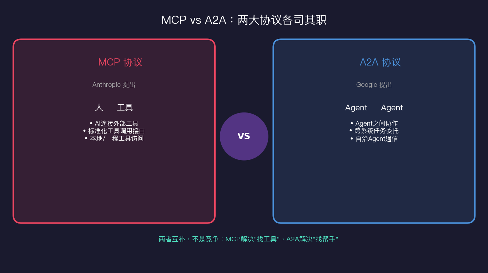
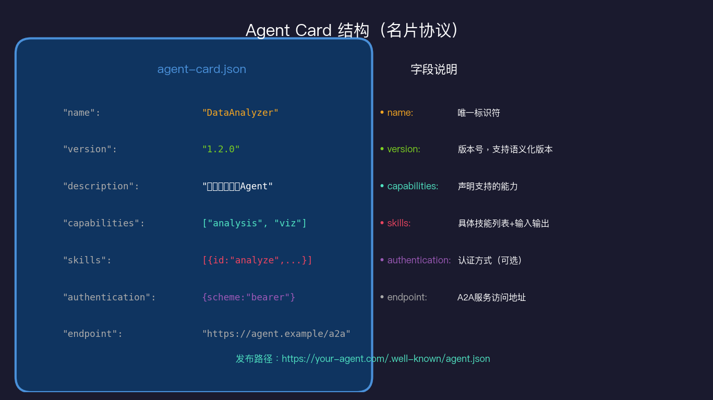
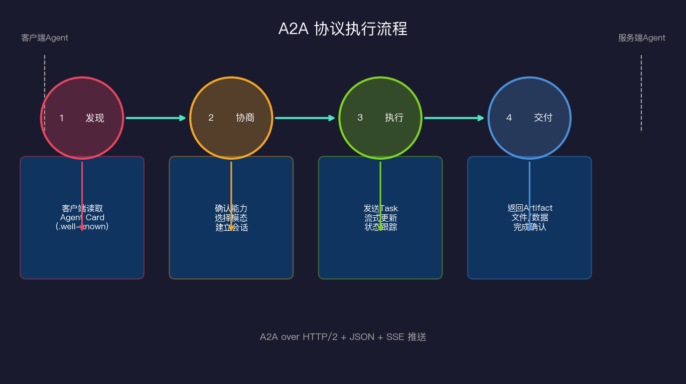
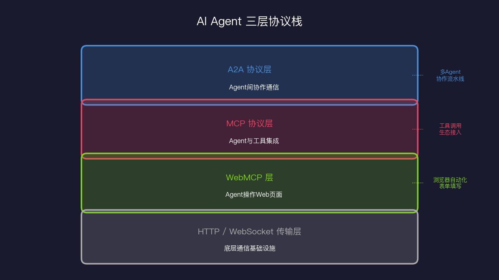

# A2A协议：Agent之间怎么对话

> MCP 解决了"AI 如何使用工具"的问题。但当工具本身也是一个 AI Agent 时，情况就不一样了。

## 一个 MCP 解决不了的场景

想象一下这个场景：你的公司有三个 AI Agent：

- **销售Agent**：负责分析客户数据，制定销售策略
- **财务Agent**：负责预算分析，审核支出合理性
- **营销Agent**：负责制作推广方案，预测转化率

你希望这三个 Agent 能够协作完成一个复杂任务："为新产品制定上市计划，包括定价策略、推广预算和预期回报"。

用 MCP 能做到吗？

技术上可以——你可以把销售Agent、财务Agent 封装成 MCP 工具，让营销Agent 调用。但问题来了：

**这种方式把有状态的、会产生中间推理过程的 Agent 强行塞进了无状态工具的框架里。**

MCP 工具的模式是：输入参数 → 执行 → 返回结果。这对文件读写、数据库查询很合适。但 Agent 之间的协作是另一回事：
- 销售Agent 可能需要问财务Agent "这个定价合理吗？"，财务Agent 可能反问"你的成本数据是怎么算的？"
- 任务可能需要来回多轮对话才能完成
- 一个 Agent 可能需要"委托"另一个 Agent 做一件事，并等待它异步完成
- 每个 Agent 都有自己的记忆和状态，不是无状态的函数

这就是 **A2A（Agent-to-Agent Protocol）** 要解决的问题。

## A2A 是什么

A2A 是 **Agent-to-Agent Protocol**，由 Google 于 2025 年 4 月提出并开源。

核心理念是：**为 Agent 定义一套标准的"名片"和"通信协议"，让不同框架、不同厂商开发的 Agent 能够互相发现、委托任务、协作完成工作。**



用一个生活类比：

- **MCP** 像是公司内部的"工具箱"——你知道有哪些工具（搜索、计算器、数据库），你直接拿来用
- **A2A** 像是公司的"外包协作"——你找到一个专业团队（另一个 Agent），把任务委托给他们，他们完成后交付成果

本质区别：**MCP 是"人-机"协议，A2A 是"机-机"协议。**

## A2A 四大核心概念

### Agent Card：Agent 的数字名片

每个支持 A2A 的 Agent 都要发布一张"Agent Card"——一个标准格式的 JSON 文件，发布在固定路径：

```
https://your-agent.com/.well-known/agent.json
```



```json
{
  "name": "DataAnalysisAgent",
  "version": "2.1.0",
  "description": "专业的数据分析Agent，擅长统计分析、可视化和商业洞察",
  "url": "https://data-agent.example.com",
  "capabilities": {
    "streaming": true,
    "pushNotifications": true,
    "stateTransitionHistory": false
  },
  "authentication": {
    "schemes": ["Bearer"]
  },
  "defaultInputModes": ["text/plain", "application/json"],
  "defaultOutputModes": ["text/plain", "application/json", "image/png"],
  "skills": [
    {
      "id": "statistical_analysis",
      "name": "统计分析",
      "description": "对数据集进行描述性统计、假设检验、回归分析",
      "tags": ["statistics", "data", "analysis"],
      "inputModes": ["application/json", "text/csv"],
      "outputModes": ["application/json", "text/plain"]
    },
    {
      "id": "data_visualization",
      "name": "数据可视化",
      "description": "生成图表：柱状图、折线图、散点图、热力图",
      "outputModes": ["image/png", "image/svg+xml"]
    }
  ]
}
```

Agent Card 是 A2A 生态的基础。有了它，其他 Agent 才能"发现"你的存在，知道你能做什么、怎么联系你。

### Task（任务）

Task 是 A2A 中的工作单元。当 Agent A 委托 Agent B 完成某件事，就创建一个 Task。

Task 有完整的生命周期：

```
submitted → working → (input-required) → completed
                    ↘ canceled
                    ↘ failed
```

每个 Task 有唯一 ID，客户端可以随时查询状态。关键特性是**异步**——A 不需要一直等待 B，可以先去做别的事，等 B 完成后通过推送或轮询获取结果。

### Message（消息）

Message 是 Agent 之间对话的基本单位。和普通聊天消息类似，但支持多模态：

```json
{
  "role": "user",
  "parts": [
    {
      "type": "text",
      "text": "请分析这个数据集，找出销售趋势"
    },
    {
      "type": "data",
      "mimeType": "text/csv",
      "data": "日期,销售额\n2025-01,100000\n..."
    }
  ]
}
```

一条 Message 可以包含文本、数据、文件、图片等多种内容混合。

### Artifact（产出物）

任务完成后，Agent 交付的成果叫 Artifact。它和 Message 结构类似，但语义不同——Message 是过程中的交流，Artifact 是最终交付的成果。

```json
{
  "name": "sales_analysis_report",
  "mimeType": "application/pdf",
  "parts": [
    {
      "type": "file",
      "mimeType": "application/pdf",
      "data": "base64encodedPDFcontent..."
    }
  ]
}
```

## A2A 协议流程：从发现到交付



完整的 A2A 协作分为四个阶段：

### 阶段一：发现（Discovery）

客户端 Agent（委托方）首先需要找到合适的服务端 Agent（执行方）。

**方式一：已知 URL，直接读取 Agent Card**

```python
import httpx

async def discover_agent(url: str) -> dict:
    async with httpx.AsyncClient() as client:
        resp = await client.get(f"{url}/.well-known/agent.json")
        return resp.json()

# 使用
card = await discover_agent("https://data-agent.example.com")
print(f"发现Agent: {card['name']} - {card['description']}")
print(f"支持技能: {[s['name'] for s in card['skills']]}")
```

**方式二：通过注册中心搜索**

这类似于服务发现（Service Discovery），目前还在发展中。可以想象未来会有"Agent 搜索引擎"。

### 阶段二：协商（Negotiation）

检查能力匹配：客户端确认服务端 Agent 支持所需的输入格式、输出格式、认证方式等。

```python
def check_compatibility(agent_card: dict, task: dict) -> bool:
    required_input = task.get("input_mode", "text/plain")
    required_output = task.get("output_mode", "text/plain")
    
    supports_input = required_input in agent_card["defaultInputModes"]
    supports_output = required_output in agent_card["defaultOutputModes"]
    
    skill_ids = [s["id"] for s in agent_card["skills"]]
    has_skill = task.get("skill_id") in skill_ids
    
    return supports_input and supports_output and has_skill
```

### 阶段三：执行（Execution）

创建 Task，发送消息，监控执行状态：

```python
import json

async def run_a2a_task(agent_url: str, task_request: dict) -> str:
    async with httpx.AsyncClient() as client:
        # 创建任务
        resp = await client.post(
            f"{agent_url}/tasks/send",
            json=task_request,
            headers={"Authorization": f"Bearer {API_KEY}"}
        )
        task = resp.json()
        task_id = task["id"]
        
        # 流式接收更新（SSE）
        async with client.stream("GET", f"{agent_url}/tasks/{task_id}/events") as stream:
            async for line in stream.aiter_lines():
                if line.startswith("data: "):
                    event = json.loads(line[6:])
                    if event["type"] == "status":
                        print(f"状态更新: {event['status']}")
                    elif event["type"] == "artifact":
                        return event["artifact"]  # 任务完成，返回结果
```

**处理"需要更多信息"的情况**

A2A 支持中途的交互式输入，这是 MCP 工具调用做不到的：

```python
async for event in task_events:
    if event["status"] == "input-required":
        # 服务端需要更多信息
        question = event["message"]["parts"][0]["text"]
        print(f"Agent 询问: {question}")
        
        # 可以是人工回答，也可以是另一个 Agent 的回答
        answer = await get_human_input(question)
        
        # 发送补充信息
        await client.post(f"{agent_url}/tasks/{task_id}/send", 
                          json={"message": {"parts": [{"type": "text", "text": answer}]}})
```

### 阶段四：交付（Delivery）

任务完成，获取 Artifact。客户端可以进一步处理这个结果，或者将其作为输入传给下一个 Agent。

## 三层协议栈：MCP、A2A、WebMCP 的分工

随着 A2A 的出现，AI Agent 生态逐渐形成了一个清晰的三层协议栈：



| 层 | 协议 | 解决问题 | 典型场景 |
|---|---|---|---|
| Agent协作层 | A2A | Agent 之间委托任务 | 多Agent流水线、专业化分工 |
| 工具集成层 | MCP | Agent 连接工具和数据 | 搜索、数据库、文件操作 |
| Web交互层 | WebMCP | Agent 操作网页 | 表单填写、数据抓取 |
| 传输层 | HTTP/WebSocket | 底层通信 | 所有上层协议的基础 |

这三层不是竞争关系，而是互补关系：

**典型的多Agent工作流**：
1. 用户委托给**编排Agent**（A2A 入口）
2. 编排Agent 通过 **A2A** 委托给专业Agent（数据分析、报告生成、邮件发送）
3. 每个专业Agent 通过 **MCP** 调用工具（数据库、LLM、文件系统）
4. 某些任务通过 **WebMCP** 操作网页（填写表单、提交数据）

三层叠加，完成一个人类需要数天才能完成的复杂工作。

## 企业级场景：多团队 Agent 协作

让我们看一个真实的企业场景：**季度销售报告自动生成**。

```
CEO: "给我一份本季度销售分析报告，包括各区域对比、TOP产品排名和下季度预测"

↓ 主控Agent（Orchestrator）通过 A2A 分配任务

├─ 数据收集Agent → 从 CRM/ERP 提取原始数据（MCP → 数据库工具）
│
├─ 统计分析Agent → 计算各项指标（Python代码执行工具）
│     ↓ 将分析结果传给 ↓
├─ 可视化Agent → 生成图表（matplotlib 工具）
│
├─ 预测Agent → 用时序模型预测下季度（ML工具）
│
└─ 报告生成Agent → 整合所有结果，生成 PDF（文档工具）
         ↓
     最终报告 → 通过邮件Agent 发送给 CEO（邮件工具）
```

整个流程：
- 编排层用 A2A（Agent 之间协作）
- 执行层用 MCP（每个 Agent 调用工具）
- 人类全程无需介入

**这正是为什么我认为 A2A 是今年最重要的协议之一**：它把"AI 做助手"升级为"AI 做团队"。一个人类，领导一支 AI 团队，完成以前需要整个部门的工作。

## A2A vs MCP 详细对比

| 维度 | MCP | A2A |
|---|---|---|
| **提出者** | Anthropic（2024年11月） | Google（2025年4月） |
| **解决问题** | AI 连接工具/数据 | Agent 之间协作 |
| **通信模式** | 请求-响应（同步为主） | 异步任务委托 |
| **状态管理** | 无状态 | 有状态（Task 生命周期） |
| **中间交互** | 不支持 | 支持（input-required 状态） |
| **能力声明** | 工具列表（JSON Schema） | Agent Card（能力 + 技能） |
| **多轮对话** | 不直接支持 | 原生支持 |
| **适用对象** | Agent ↔ 工具/数据源 | Agent ↔ Agent |
| **生态成熟度** | 成熟（2024年底已有大量Server） | 发展中（2025年起） |

**何时用 MCP**：你的工具是无状态的函数（搜索、数据库查询、文件操作）

**何时用 A2A**：你的"工具"本身是有状态的 Agent（需要多轮推理、有记忆、自主规划）

## 我的看法：A2A 还在早期，但方向对了

坦白说，A2A 在 2025 年还比较早期，生产环境的案例不多，工具链还不完善。

但我认为**方向是对的，而且是必然的**。

随着 AI Agent 能力越来越强，企业的自然演化路径是：
1. **单 Agent**：一个 AI 做所有事
2. **Agent + 工具**：AI 调用工具（MCP 的世界）
3. **多 Agent 协作**：专业化 Agent 组成团队（A2A 的世界）
4. **Agent 生态**：Agent 市场，按需调用（未来）

我们现在处于第 2-3 阶段的过渡期。A2A 提前布局了第 3 阶段的协议标准。

**一个实用建议**：如果你今天在构建复杂的多 Agent 系统，可以先用 LangGraph 或 CrewAI 做内部编排，同时开始熟悉 A2A 的概念和 SDK。等生态成熟时，你已经准备好了。

## 参考资料

- [A2A 官方 GitHub](https://github.com/google/a2a-protocol)
- [A2A 协议规范](https://google.github.io/a2a/)
- [Google A2A 发布博客](https://developers.googleblog.com/en/agent2agent-interoperability-protocol-for-ai-agents/)
- [A2A Python SDK](https://github.com/google/a2a-python)
- [MCP 官方文档](https://modelcontextprotocol.io/)
- [多 Agent 协作论文综述](https://arxiv.org/abs/2404.02831)
- [CrewAI 框架文档](https://docs.crewai.com/)
