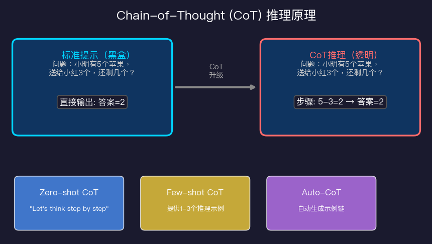
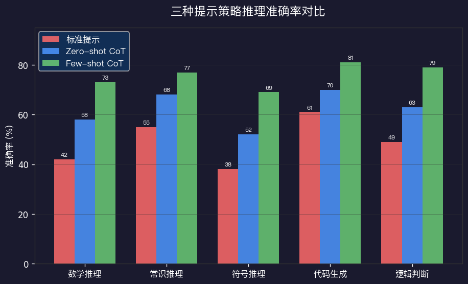
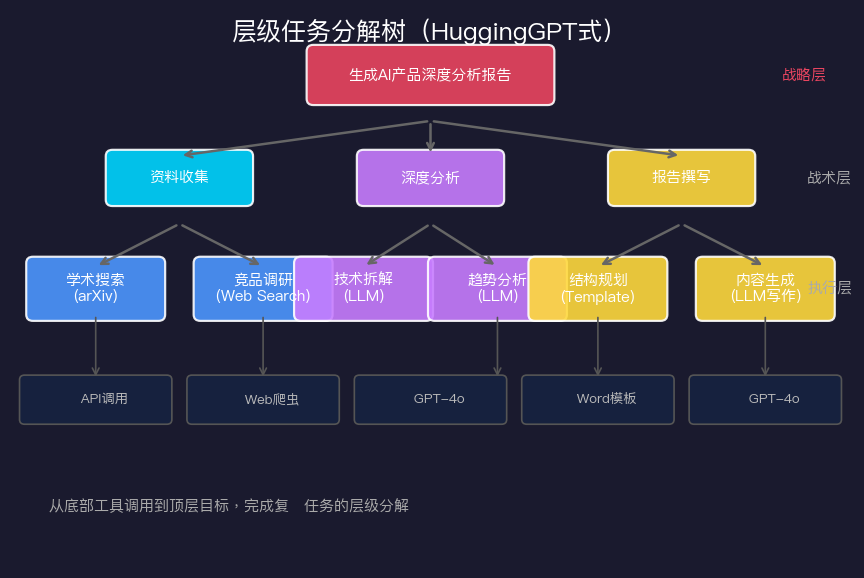
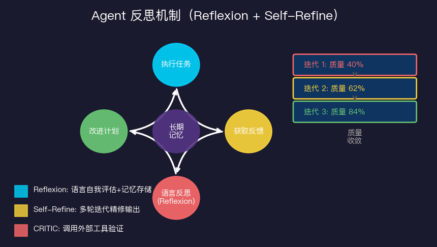
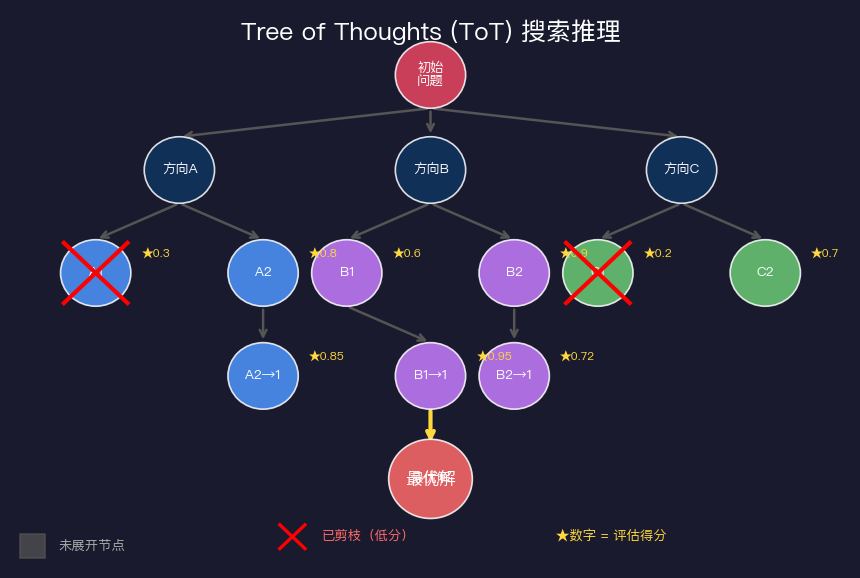

# Agent规划与推理：思维链的力量

> 如果说工具调用让Agent有了"手"，那么规划与推理就是Agent的"大脑"。一个没有推理能力的Agent，顶多是个自动化脚本；而一个具备规划能力的Agent，才能真正解决复杂问题。

---

## 什么是推理，为什么它如此重要

在讨论Chain-of-Thought之前，先问一个基础问题：模型"推理"和"记忆"有什么区别？

模型的权重里存着世界知识（记忆），但面对一个新问题时，它需要**在上下文窗口里进行实时计算**——这就是推理。推理的质量决定了模型能否把已知知识正确应用到未知问题上。

大量实验表明，同一个模型，用不同的提示方式，推理质量可以相差20-40%。这意味着提示工程不是玄学，而是直接影响模型内部计算路径的工程手段。

CoT（Chain-of-Thought，思维链）就是其中最重要的发现之一。

---

## Chain-of-Thought：让模型"说出思考过程"

2022年，Google Brain的研究人员发现了一个惊人的现象：只要在提示词里加上**"Let's think step by step"**，模型在数学推理任务上的准确率就能大幅提升。这就是Zero-shot CoT的核心思想。

原理并不神秘：当模型被迫"说出"中间步骤时，它实际上在做两件事：

1. **把复杂计算分解成多个简单步骤**，每一步都在上下文里可见，避免了"一步跳结论"的错误
2. **利用自回归特性进行自我校正**，因为每个token的生成都能看到前面的推理过程



上图展示了标准提示和CoT提示的区别。标准提示把问题直接映射到答案，是黑盒；CoT则把推理过程展开，每一步都是可检查的中间状态。

### Zero-shot CoT vs Few-shot CoT vs Auto-CoT

**Zero-shot CoT** 是最简单的形式，只需在提示末尾加上"让我们一步一步思考"类似的触发词。适合快速尝试，但效果有上限。

**Few-shot CoT** 则需要你提供几个"问题+推理过程+答案"的完整示例。模型会学习你的推理风格，效果通常更好，但需要人工准备示例，且示例质量直接影响结果。

**Auto-CoT**（自动CoT）则是两者的折中：自动聚类同类问题，为每类问题生成代表性示例，再组合成Few-shot提示。这样不需要人工写示例，又比Zero-shot更稳定。



从实验数据看，Few-shot CoT在大多数任务上领先10-15个百分点，但代价是需要更多提示token和示例准备工作。我的建议是：**原型阶段用Zero-shot快速验证，生产阶段用Few-shot CoT提升稳定性**。

---

## 任务分解：从大任务到可执行子步骤

CoT解决的是"单步推理"问题。但现实中，Agent面对的往往是**复杂的长链任务**：写一份调研报告、开发一个功能、处理一批数据……

这类任务不能靠一个大提示搞定，必须进行**任务分解（Task Decomposition）**。

HuggingGPT（2023年）是一个经典案例：它让GPT-4充当"任务规划师"，把用户请求拆解成一系列子任务，然后为每个子任务选择合适的专门模型（图像生成用Stable Diffusion，语音用Whisper，等等），最后把结果汇总。

这种分解模式本质上是一棵树：



树的三层对应三种抽象级别：

**战略层（Why）**：明确目标是什么，比如"生成AI产品深度分析报告"

**战术层（What）**：把目标拆成几个可操作的方向，比如"资料收集"、"深度分析"、"报告撰写"

**执行层（How）**：每个方向再拆成具体的工具调用或模型调用，比如"调用arXiv API搜索论文"、"调用LLM提取摘要"

### 实用技巧：让分解更可靠

任务分解听起来简单，实际做起来有几个坑：

**坑1：分解过细导致上下文丢失**。子任务之间需要共享上下文，分解太细会导致每个子任务不知道整体目标。解决方案是维护一个"共享任务记忆"，让每个子任务都能访问高层目标描述。

**坑2：分解路径固化，遇到意外无法调整**。好的系统应该支持"动态重规划"——当某个子任务失败或结果不符合预期时，能回到规划层重新调整。

**坑3：并发子任务之间没有依赖管理**。哪些任务可以并行？哪些必须顺序执行？这需要在规划阶段明确声明依赖关系。

---

## 反思机制：让Agent从错误中学习

标准的Agent执行流程是：规划→执行→输出。这是一个开环系统，没有质量反馈。

**反思机制**（Reflection）为Agent加上了闭环：执行完之后，先评估自己的输出质量，再决定是否需要修改。



目前最成熟的三种反思方法：

### Reflexion

Reflexion（2023年，Shinn等人）的核心思想是：用**语言作为记忆**。

具体流程：
1. Agent执行任务，得到结果
2. 评估器（可以是另一个LLM或规则引擎）评分，判断是否成功
3. 如果失败，让Agent用自然语言写一段"经验总结"（比如"我犯的错误是X，下次应该Y"）
4. 把这段总结存入记忆，下次执行类似任务时作为上下文

这个方法的妙处在于：LLM本身就是语言模型，用语言描述的教训比纯数值更容易被模型"理解"和利用。

### Self-Refine

Self-Refine更简单粗暴：让同一个模型多次迭代改进自己的输出。

流程：生成初稿 → 自我评估 → 提出改进建议 → 基于建议修改 → 循环

实验表明，经过2-3轮Self-Refine，输出质量通常会有明显提升，但轮数过多会出现"过拟合"——模型开始执着于某个方向反复优化，反而偏离了原始目标。

### CRITIC

CRITIC（2023年）走的是不同路子：它不依赖模型的自我评估，而是**调用外部工具进行验证**。

比如，代码生成任务中，CRITIC会把生成的代码实际运行一遍，把报错信息反馈给模型；数学计算任务中，会用计算器验证结果。这样避免了"自说自话"的问题——模型自己认为正确，不代表真的正确。

**我的实践观察**：Reflexion适合长期任务和多轮对话；Self-Refine适合内容生成类任务（写作、翻译）；CRITIC适合有客观验证标准的任务（代码、数学）。实际项目中，我通常把三者结合使用。

---

## 层级规划：战略层→战术层→执行层

前面提到了任务分解的三层结构。这里更详细地讨论"层级规划"这个架构模式。

层级规划借鉴了人类组织的管理层级。一个大公司运转不靠CEO直接管每个员工，而是通过管理层级将决策下放。同样，一个复杂Agent系统不应该让一个模型处理从战略到执行的所有决策。

**战略层（Strategic Layer）**：
- 理解用户意图，明确最终目标
- 把目标转化为高层计划（几个大步骤）
- 识别可用资源和约束条件
- 模型：通常用能力最强的模型（GPT-4o/Claude 3.5）

**战术层（Tactical Layer）**：
- 把大步骤细化为可执行的子任务序列
- 处理步骤之间的依赖关系
- 分配资源（工具、API、子Agent）
- 模型：中等能力的模型（Claude Haiku/GPT-3.5）

**执行层（Execution Layer）**：
- 调用具体工具或API
- 处理错误和重试
- 返回结构化结果
- 通常是确定性代码，不是模型

这个分层设计有几个好处：成本优化（贵的模型只做高层决策）、可维护性（修改某一层不影响其他层）、可追溯性（每一步都有日志）。

---

## Tree of Thoughts：搜索式推理

CoT是一条直线：一步接一步往下推。但很多复杂问题不是线性的——有时候你需要**同时探索多条思路**，然后选最好的。

这就是Tree of Thoughts（ToT，2023年，Yao等人）的核心思想：把推理过程建模成一棵搜索树。



ToT的四个核心步骤：

1. **思路生成（Thought Generation）**：在每个节点，让模型生成多个候选的"下一步想法"（3-5个）

2. **状态评估（State Evaluation）**：用模型（或启发式函数）给每个候选思路打分，评估它距离目标有多近

3. **搜索策略（Search Algorithm）**：BFS（广度优先）保证找到最优解，DFS（深度优先）更省内存，Beam Search在两者之间取平衡

4. **剪枝（Pruning）**：得分低于阈值的分支直接丢弃，节省计算

ToT在需要规划和搜索的任务上（游戏、数学证明、代码调试）效果显著，但代价是**大量额外的LLM调用**，成本可能是普通CoT的5-10倍。

**什么时候该用ToT？**我的经验法则：当问题有明确的"正确答案"或评估标准、且多个解路径之间差异显著时，ToT值得投入。对于日常的信息检索、总结类任务，普通CoT足够了。

---

## 什么时候该让Agent自己想，什么时候硬编码工作流

这是我认为最重要也最容易被忽视的问题。不是所有步骤都需要AI推理，盲目地把一切交给Agent决策，往往会导致：

- **不稳定**：模型每次的规划路径不同，难以预测
- **成本高**：推理token消耗巨大
- **难调试**：出问题时不知道错在哪一步

我的决策框架：

**硬编码工作流适合的场景**：
- 流程固定，每次执行路径基本相同
- 对稳定性和一致性要求高（金融、医疗）
- 步骤之间有严格的顺序依赖
- 已经充分理解问题结构

**让Agent动态规划适合的场景**：
- 问题结构多变，无法穷举所有情况
- 需要根据中间结果调整策略
- 处理新颖的、未见过的任务类型
- 探索性任务，优先发现新路径

**实践中的折中方案**：骨架固定+细节动态。主要流程节点硬编码（保证稳定性），但每个节点内部的执行细节交给Agent决策（保留灵活性）。这是目前生产级系统中最常见的架构。

比如一个客服Agent：接单→分类→处理→回复 这四步硬编码，但"处理"这个节点内部让Agent根据具体问题类型选择不同工具和策略。

---

## 实战：把CoT用进你的Agent

说了这么多理论，给几个实用的代码片段：

```python
# Zero-shot CoT 提示模板
zero_shot_cot_template = """
{question}

让我们逐步思考这个问题：
"""

# Few-shot CoT 构建器
def build_few_shot_cot(examples, question):
    """
    examples: [(question, reasoning_steps, answer), ...]
    """
    prompt = ""
    for q, steps, a in examples:
        prompt += f"问题：{q}\n"
        prompt += f"思考过程：\n{steps}\n"
        prompt += f"答案：{a}\n\n"
    prompt += f"问题：{question}\n思考过程：\n"
    return prompt

# Reflexion 反思模板
reflexion_template = """
你刚才完成了以下任务：
任务：{task}
你的输出：{output}
评估结果：{evaluation}

请反思：
1. 你犯了什么错误？
2. 为什么会犯这个错误？
3. 下次遇到类似任务，你会怎么做不同？

反思总结：
"""
```

---

## 总结：推理能力的本质

规划与推理不是魔法，本质是**把复杂问题分解成LLM能可靠处理的小步骤**。CoT、任务分解、反思机制、ToT，都是不同层面上的"分解策略"。

关键洞察：LLM在单步推理上很强，在长链、多步推理上容易犯错。好的Agent设计，就是尽量缩短每一步的推理链，同时通过架构设计保证整体目标不偏移。

下一篇我们来看具体的Agent框架，把这些推理机制落地到代码层面。

---

## 参考资料

- Wei et al. (2022). Chain-of-Thought Prompting Elicits Reasoning in Large Language Models. *NeurIPS 2022*
- Kojima et al. (2022). Large Language Models are Zero-Shot Reasoners. *NeurIPS 2022*
- Zhang et al. (2022). Automatic Chain of Thought Prompting in Large Language Models. *ICLR 2023*
- Yao et al. (2023). Tree of Thoughts: Deliberate Problem Solving with Large Language Models. *NeurIPS 2023*
- Shinn et al. (2023). Reflexion: Language Agents with Verbal Reinforcement Learning. *NeurIPS 2023*
- Madaan et al. (2023). Self-Refine: Iterative Refinement with Self-Feedback. *NeurIPS 2023*
- Gou et al. (2023). CRITIC: Large Language Models Can Self-Correct with Tool-Interactive Critiquing. *ICLR 2024*
- Shen et al. (2023). HuggingGPT: Solving AI Tasks with ChatGPT and its Friends in HuggingFace. *NeurIPS 2023*
