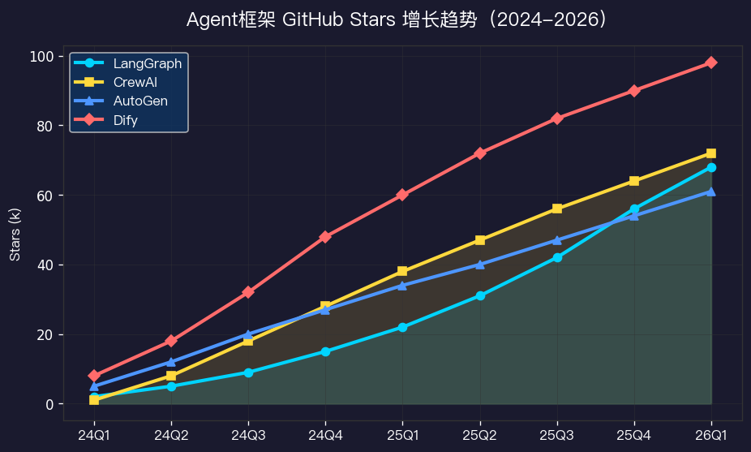
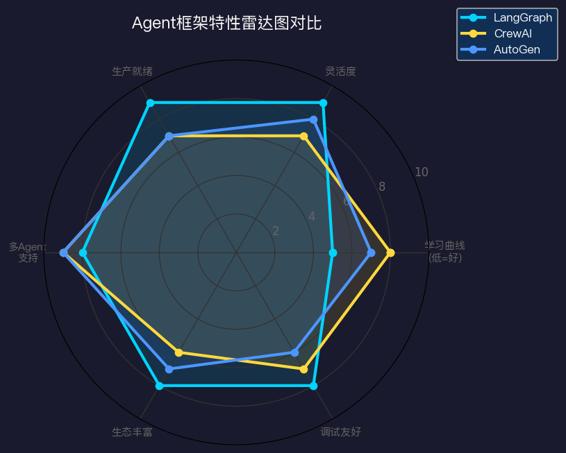
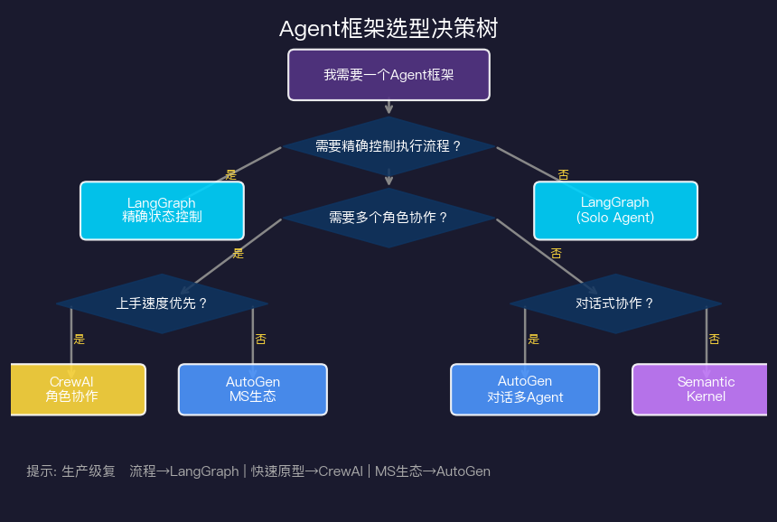
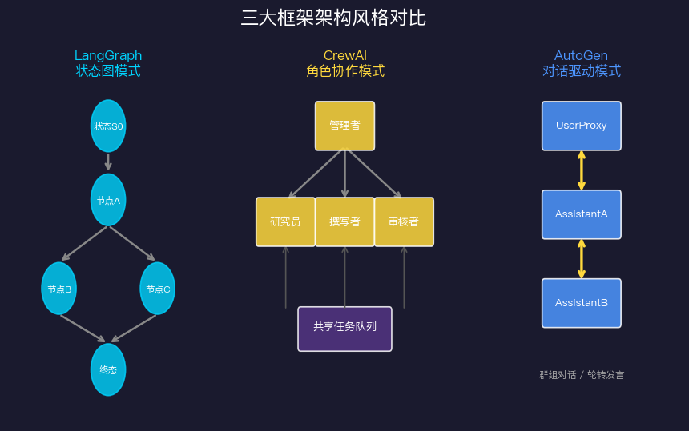

# Agent框架横评：LangGraph vs CrewAI vs AutoGen

> 选错框架的代价是巨大的——不只是重写代码的成本，更是整个团队的认知负担和维护噩梦。这篇文章帮你在真正动手之前，把框架选型想清楚。

---

## 2026年的框架格局

Agent框架这两年爆发式增长，数量多到让人眼花缭乱。但真正在生产环境经受住考验、有活跃社区支撑的，主要是三个：**LangGraph、CrewAI、AutoGen**。



从趋势图看，Dify（低代码平台）Stars增长最猛，但它本质上是个产品而非开发框架，面向的是非技术用户。在纯开发框架里：

- **LangGraph**：LangChain团队出品，从LangChain的混乱中重生，Stars增长稳健，社区质量高
- **CrewAI**：上手最快，适合多Agent角色协作，增长曲线最陡峭
- **AutoGen**：微软出品，对话式多Agent，有强大的企业背书

三个框架的GitHub Stars（截至2026年初）大致都在60k-70k量级，已经是成熟框架了。

---

## LangGraph：精确控制的状态图

LangGraph是LangChain从"万能链条"范式转向"状态图"范式的产物。如果你用过早期的LangChain，一定经历过Chain嵌套Chain、调试像深入地狱的体验。LangGraph彻底解决了这个问题。

**核心概念**：

- **State（状态）**：一个字典，存储整个Agent运行过程中的所有数据
- **Node（节点）**：一个函数，接受State，返回更新后的State
- **Edge（边）**：节点之间的连接，可以是条件分支（根据State的值选择不同路径）
- **Graph（图）**：把节点和边组合成完整的执行流程

```python
from langgraph.graph import StateGraph, END
from typing import TypedDict, Annotated
import operator

# 定义状态类型（强类型，编辑器有代码提示）
class AgentState(TypedDict):
    messages: Annotated[list, operator.add]  # 消息列表，add操作符表示追加
    current_step: str
    result: str | None

# 定义节点函数
def planner_node(state: AgentState) -> AgentState:
    """规划节点：分析任务，制定计划"""
    messages = state["messages"]
    # 调用LLM生成计划
    plan = llm.invoke(messages)
    return {
        "messages": [plan],
        "current_step": "execute"
    }

def executor_node(state: AgentState) -> AgentState:
    """执行节点：调用工具执行计划"""
    # 实际执行逻辑
    result = execute_tools(state["messages"])
    return {
        "result": result,
        "current_step": "review"
    }

def reviewer_node(state: AgentState) -> AgentState:
    """审核节点：检查结果质量"""
    result = state["result"]
    if quality_check(result):
        return {"current_step": "done"}
    else:
        return {"current_step": "execute", "messages": [f"需要改进：{result}"]}

# 条件路由函数
def should_continue(state: AgentState) -> str:
    if state["current_step"] == "done":
        return END
    return state["current_step"]

# 构建图
workflow = StateGraph(AgentState)
workflow.add_node("planner", planner_node)
workflow.add_node("executor", executor_node)
workflow.add_node("reviewer", reviewer_node)

workflow.set_entry_point("planner")
workflow.add_edge("planner", "executor")
workflow.add_conditional_edges("reviewer", should_continue, {
    "execute": "executor",
    END: END
})
workflow.add_edge("executor", "reviewer")

app = workflow.compile()
```

**LangGraph的优势**：

1. **可视化友好**：图结构可以直接渲染成流程图，产品和工程都能看懂
2. **状态完全可控**：你知道在任何时刻，系统处于什么状态
3. **支持循环**：可以实现"执行→检查→如果不满意就重新执行"的反思循环
4. **生产就绪**：有检查点（Checkpoint）机制，支持暂停、恢复、人工干预
5. **LangSmith集成**：调试和观测能力一流

**LangGraph的缺点**：

学习曲线陡。你需要理解图论的基本概念，需要设计好状态Schema，需要想清楚所有可能的边和条件。对于简单任务，代码量是CrewAI的3-5倍。

---

## CrewAI：角色协作，上手最快

CrewAI的设计哲学更接近人类团队：定义几个"角色"（Role），每个角色有自己的职责描述和可用工具，然后让他们协作完成任务。

```python
from crewai import Agent, Task, Crew, Process
from crewai_tools import SerperDevTool, FileWriterTool

# 定义工具
search_tool = SerperDevTool()
write_tool = FileWriterTool()

# 定义Agent角色
researcher = Agent(
    role='技术研究员',
    goal='收集和分析最新的AI Agent相关论文和技术趋势',
    backstory="""你是一位经验丰富的技术研究员，擅长从学术论文和技术博客中
    提炼核心观点。你的分析总是客观、深入、有洞察力。""",
    tools=[search_tool],
    verbose=True,
    max_iter=5,  # 最多迭代5次
    llm="gpt-4o"
)

writer = Agent(
    role='技术作家',
    goal='将研究结果转化为清晰易读的技术文章',
    backstory="""你是一位专注于AI领域的技术作家，擅长把复杂概念讲得通俗易懂。
    你的文章既有深度，又不失趣味性。""",
    tools=[write_tool],
    verbose=True,
    llm="gpt-4o"
)

# 定义任务
research_task = Task(
    description="""研究2025年最重要的5个AI Agent技术突破。
    对每个突破，提供：(1)简要描述 (2)技术原理 (3)实际影响""",
    expected_output="一份结构化的研究报告，包含5个技术突破的详细分析",
    agent=researcher
)

writing_task = Task(
    description="""基于研究报告，写一篇面向技术读者的博客文章。
    文章应该通俗易懂，有个人观点，长度1500-2000字。""",
    expected_output="一篇完整的博客文章，保存到output/article.md",
    agent=writer,
    output_file="output/article.md",
    context=[research_task]  # 依赖研究任务的输出
)

# 创建团队并执行
crew = Crew(
    agents=[researcher, writer],
    tasks=[research_task, writing_task],
    process=Process.sequential,  # 顺序执行
    verbose=True
)

result = crew.kickoff()
```

**CrewAI的优势**：

1. **概念直觉**：用"角色"来组织逻辑，和人类团队协作方式一致，非技术人员也能理解
2. **上手最快**：5分钟就能跑起来一个多Agent系统
3. **任务依赖管理**：`context=[research_task]`一行代码就能声明任务依赖
4. **丰富的工具生态**：CrewAI Tools包含大量预构建工具

**CrewAI的缺点**：

控制粒度不够精细。框架帮你处理了大量细节，但当你需要自定义执行流程时，会发现很难突破框架限制。对于需要复杂条件分支、错误处理或性能优化的生产系统，CrewAI往往力不从心。

---

## AutoGen：Microsoft出品，对话式多Agent

AutoGen（微软研究院）的核心概念是**对话（Conversation）**。不同的Agent通过相互发消息来协作，整个系统的行为由消息的流转驱动。

```python
from autogen import AssistantAgent, UserProxyAgent, GroupChat, GroupChatManager
import autogen

# 配置
config_list = [{"model": "gpt-4o", "api_key": "..."}]
llm_config = {"config_list": config_list}

# 创建助手Agent
coder = AssistantAgent(
    name="Coder",
    system_message="""你是一位Python专家。
    当被要求编写代码时，先分析需求，再给出完整的可运行代码。
    代码必须包含注释和错误处理。""",
    llm_config=llm_config
)

reviewer = AssistantAgent(
    name="CodeReviewer", 
    system_message="""你是代码审查专家。
    你的任务是审查Coder生成的代码，指出潜在的bug、性能问题和安全漏洞。
    如果代码没有问题，回复'代码审查通过'。""",
    llm_config=llm_config
)

# UserProxy：代表人类，可以执行代码
user_proxy = UserProxyAgent(
    name="User",
    human_input_mode="NEVER",  # 全自动，不需要人工干预
    max_consecutive_auto_reply=10,
    code_execution_config={
        "work_dir": "coding",
        "use_docker": False,  # 生产环境建议用Docker
    },
    is_termination_msg=lambda x: "代码审查通过" in x.get("content", "")
)

# GroupChat：多Agent同时参与的群聊
groupchat = GroupChat(
    agents=[user_proxy, coder, reviewer],
    messages=[],
    max_round=20,
    speaker_selection_method="auto"  # 自动决定谁发言
)

manager = GroupChatManager(groupchat=groupchat, llm_config=llm_config)

# 启动对话
user_proxy.initiate_chat(
    manager,
    message="请帮我实现一个函数，计算两个列表的Jaccard相似度，并写单元测试。"
)
```

**AutoGen的优势**：

1. **灵活的对话模式**：支持一对一、群聊、嵌套对话等多种模式
2. **代码执行能力**：内置代码执行器，Agent可以真正运行代码并根据结果调整
3. **Microsoft生态**：与Azure OpenAI、Semantic Kernel深度集成
4. **人机协作**：`human_input_mode`设置为"ALWAYS"时，人类可以随时介入对话

**AutoGen的缺点**：

对话流程不够确定性。在GroupChat模式下，"谁下一个发言"由模型决定，不总是符合预期。生产环境中，这种不确定性会带来稳定性问题。

---

## 横向对比：一张表看清差异



| 维度 | LangGraph | CrewAI | AutoGen |
|------|-----------|--------|---------|
| 学习曲线 | 陡（需要理解图论） | 平缓（角色概念直观） | 中等 |
| 灵活度 | 最高（精确控制每个节点） | 中等（受框架约束） | 高（对话驱动） |
| 生产就绪 | 最强（检查点、人工干预、调试） | 中等 | 中等 |
| 多Agent支持 | 通过子图实现 | 原生支持角色协作 | 原生支持群聊 |
| 调试能力 | 最好（LangSmith集成） | 一般 | 一般 |
| 代码量 | 多 | 少 | 中 |
| 适合团队 | 有经验的工程师 | 快速原型/产品经理 | 研究/企业 |

---

## 其他值得关注的框架

**Semantic Kernel（微软）**：企业级AI编排框架，天然适合.NET/C#生态，与Microsoft 365深度集成。Python SDK也在快速成熟。如果你的技术栈是微软体系，优先考虑。

**Haystack（deepset）**：专注于RAG（检索增强生成）和文档处理的框架。如果你的核心场景是知识库问答、文档分析，Haystack的管道（Pipeline）设计比通用Agent框架更合适。

**Dify**：低代码Agent构建平台。不需要写代码，通过可视化界面拖拽搭建工作流。适合非技术团队快速验证业务想法。但灵活性有限，生产化有门槛。

**Agno（前身LlamaIndex Workflows）**：异步优先的Agent框架，性能好，适合高并发场景。生态相比LangGraph还小，但值得关注。

---

## 选型决策树：按场景和团队选



用一句话总结选型逻辑：

- **需要精确控制执行流程、上生产** → **LangGraph**
- **需要快速原型、多角色协作** → **CrewAI**
- **微软技术栈、对话驱动** → **AutoGen**
- **主要做RAG/文档处理** → **Haystack**
- **不想写代码** → **Dify**

---

## 架构对比：三种框架的本质差异



三个框架背后代表三种不同的世界观：

- **LangGraph**：Agent是状态机。世界是可预测的图，每条路径都经过设计
- **CrewAI**：Agent是角色扮演者。世界是职责分明的团队，协作靠分工
- **AutoGen**：Agent是对话参与者。世界是一场群聊，结果从对话中涌现

没有哪个"最好"，只有哪个最适合你的具体场景。

---

## 我的实际经验

用过三个框架之后，我的感受：

LangGraph的图结构设计迫使你在动手写代码之前就把整个执行流程想清楚。这个"强迫"是双刃剑——设计期间更费劲，但调试期间省心很多。对于要上生产的系统，这种前期投入是值得的。

CrewAI让我用两小时搭出了一个多Agent的内容生成系统，并且实际跑出了不错的效果。但当我试图加入错误处理和自定义路由时，发现框架的抽象层开始成为障碍。适合快速验证，不适合长期维护。

AutoGen的代码执行能力很惊艳——让Agent真正能运行自己生成的代码，并根据运行结果迭代，这是其他框架没有的内置能力。但群聊模式下，Agent之间"自由发挥"导致了好几次意外的无限循环。

---

## 参考资料

- LangGraph Documentation: https://langchain-ai.github.io/langgraph/
- CrewAI Documentation: https://docs.crewai.com/
- AutoGen Documentation: https://microsoft.github.io/autogen/
- Wu et al. (2023). AutoGen: Enabling Next-Gen LLM Applications via Multi-Agent Conversation. *arXiv:2308.08155*
- Semantic Kernel: https://learn.microsoft.com/en-us/semantic-kernel/
- Haystack Documentation: https://docs.haystack.deepset.ai/
- Shafey et al. (2024). A Survey of Agent Frameworks for LLMs. *arXiv preprint*
