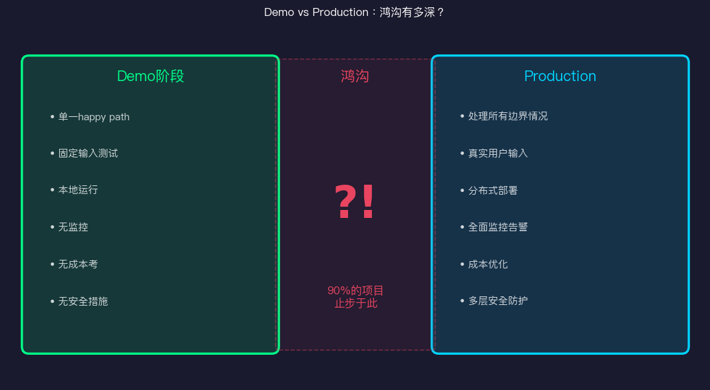
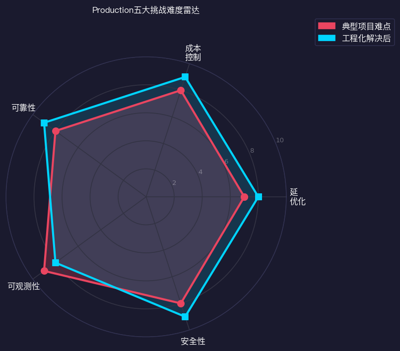
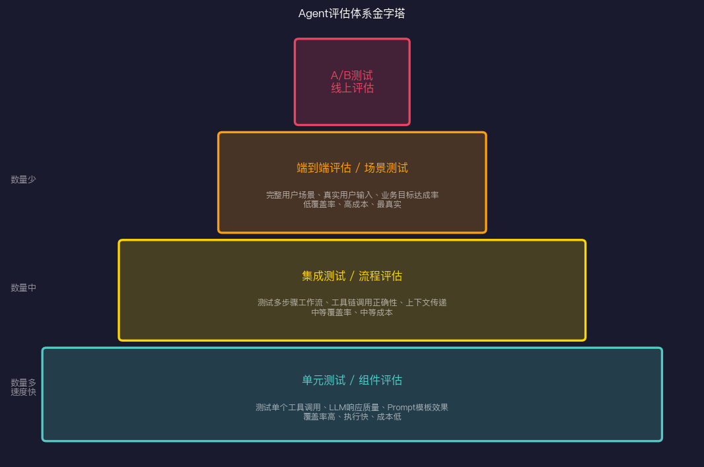
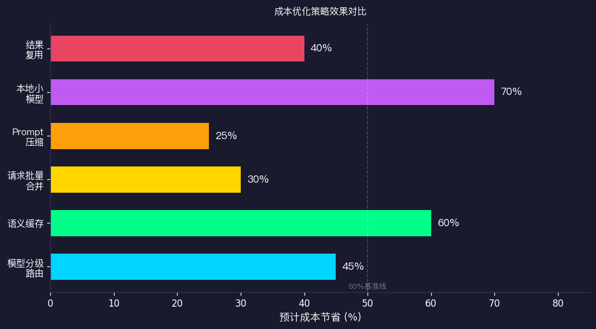
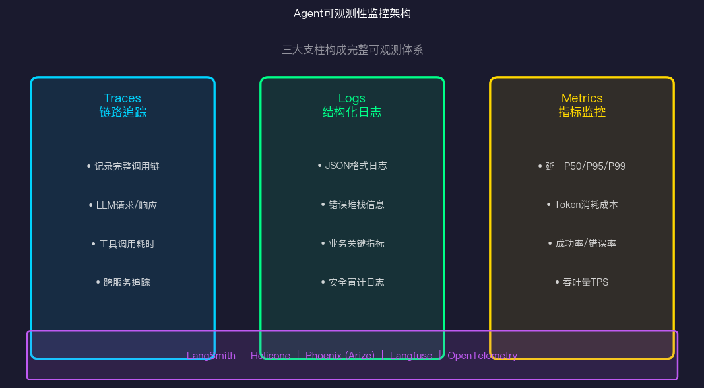

# Agent落地实战：从Demo到Production的鸿沟

> Day 12 · AI Agent 30天系列

每个开发者都经历过这个时刻：Demo跑得完美，演示成功，大家都鼓掌。然后你把它部署到生产环境……

然后就开始崩了。

延迟高得离谱，偶尔幻觉，用户反馈"说了半天没做成事"，成本比预期高了10倍，出了问题根本不知道从哪查。

这不是你的Agent不好——这是**Demo和Production之间的那道鸿沟**。几乎每个做Agent的人都会掉进去。



今天这篇文章，聊聊怎么跨越这道鸿沟。

---

## 为什么90%的Agent项目死在Demo阶段

首先要理解，Demo和Production面对的是完全不同的问题。

**Demo的世界**：
- 你自己设计测试输入，都是Happy Path
- 在自己的笔记本上跑，不考虑并发
- 出了问题重新运行
- 没有真实用户，没有边界情况

**Production的世界**：
- 用户的输入千奇百怪，你没法预测
- 要处理并发请求，高峰时可能是100倍负载
- 出了问题用户在等，你必须快速定位
- 延迟、成本、可靠性、安全，每一个都是系统性问题

关键洞察：**大多数Agent项目在Demo阶段就被设计为不可生产化的架构**。等到发现问题，重构成本太高，项目就死了。

解法不是先做Demo再想Production，而是从一开始就按Production的标准设计。

---

## 生产化五大挑战



### 挑战1：延迟

LLM本身就慢。GPT-4 Turbo的P50延迟大约在1-3秒，但在Agent场景里，一个任务可能需要3-5轮LLM调用，再加上工具调用的网络延迟，总延迟轻松上10秒。

用户能接受多少延迟？研究显示：
- 简单问答：< 3秒
- 复杂任务：< 30秒（需要进度反馈）
- 后台任务：可以更长，但需要状态更新

**优化方向**：
- Streaming响应：让用户看到生成过程
- 并行工具调用：不要串行执行可以并行的工具
- 模型选择：简单任务用轻量模型
- 预计算：对常见请求预热缓存

### 挑战2：成本

你可能在Demo时没在意Token消耗，但在Production里，这是实实在在的钱。

一个中等复杂的Agent任务，平均消耗：
- System Prompt：500-2000 tokens
- 对话历史：每轮累积，10轮对话可能达到10000+ tokens
- 工具响应：每次调用返回的数据，可能很大
- 总计：单次完整任务 5000-50000 tokens

以GPT-4的价格，单次任务成本0.05-0.5美元。如果你有10万日活，每天至少5000-50000美元的模型费用。

### 挑战3：可靠性

Agent的可靠性问题比传统软件复杂，因为失败有多种形式：
- 技术失败：API超时、网络错误、服务不可用
- 语义失败：Agent理解错了意图，执行了错误操作
- 幻觉失败：Agent生成了看起来正确但实际错误的结果
- 部分失败：多步骤任务完成一半后崩溃

### 挑战4：可观测性

出了问题你能找到原因吗？Agent的黑盒性质让调试极其困难。用户说"它不工作"，你需要知道：是哪一步失败的？LLM的决策是什么？工具调用了什么参数？返回了什么？

### 挑战5：安全性

上一篇专门讲了，这里不重复。

---

## 评估体系：你的Agent到底好不好

在解决上面的挑战之前，你首先需要能**量化**你的Agent有多好。没有评估就没有改进。



### 第一层：单元测试 / 组件评估

测试Agent的各个组成部分：

**工具调用评估**：给定输入，Agent是否调用了正确的工具，使用了正确的参数？

```python
def test_tool_selection():
    agent = create_test_agent()
    result = agent.process("查一下今天的天气")
    
    assert result.tool_called == "get_weather"
    assert "location" in result.tool_params
    assert result.tool_params["location"] != ""
```

**LLM响应质量评估**：使用另一个LLM作为评委（LLM-as-Judge），评估响应的相关性、准确性、格式。

```python
def evaluate_response_quality(question, response, reference):
    judge_prompt = f"""
    问题：{question}
    参考答案：{reference}
    待评估答案：{response}
    
    请从1-10分评估答案质量，给出分数和理由。
    """
    score = judge_llm(judge_prompt)
    return score
```

**Prompt效果评估**：对比不同Prompt版本在标准测试集上的表现。

### 第二层：集成测试 / 流程评估

测试多个组件协作的完整工作流：

```python
class WorkflowEvaluator:
    def evaluate_stock_analysis_flow(self, test_cases):
        results = []
        for case in test_cases:
            # 运行完整的股票分析流程
            result = self.agent.run(case["input"])
            
            # 评估各个步骤
            score = {
                "data_fetch": self.check_data_fetched(result),
                "analysis_quality": self.evaluate_analysis(result, case["reference"]),
                "format_correct": self.check_output_format(result),
                "tool_sequence": self.check_tool_order(result),
            }
            results.append(score)
        
        return self.aggregate_scores(results)
```

### 第三层：端到端评估 / 场景测试

最接近真实场景的测试。使用真实用户的输入（脱敏后），测量业务目标的达成率。

**关键指标**：
- **任务完成率**：用户的目标是否达到
- **交互轮数**：完成任务需要几次来回
- **用户满意度**：如果有用户反馈的话
- **错误率**：执行了错误操作的比例

---

## 成本优化：花钱要花在刀刃上



### 策略1：模型分级路由

不是每个任务都需要最强的模型。

```python
class ModelRouter:
    def route(self, task: Task) -> str:
        complexity = self.estimate_complexity(task)
        
        if complexity < 0.3:
            return "gpt-4o-mini"    # 简单任务，便宜快速
        elif complexity < 0.7:
            return "gpt-4o"         # 中等任务
        else:
            return "claude-opus-4"  # 复杂推理任务
    
    def estimate_complexity(self, task: Task) -> float:
        indicators = [
            len(task.context) > 5000,     # 长上下文
            task.requires_reasoning,       # 需要推理
            task.has_code_generation,      # 代码生成
            task.multi_step_planning,      # 多步规划
        ]
        return sum(indicators) / len(indicators)
```

实测节省：单纯路由策略可以降低40-60%的模型费用。

### 策略2：语义缓存

相似的问题不需要重新计算。

```python
class SemanticCache:
    def __init__(self, similarity_threshold=0.95):
        self.threshold = similarity_threshold
        self.cache = {}
        self.embedder = get_embedder()
    
    async def get_or_compute(self, query: str, compute_fn):
        query_embedding = await self.embedder.embed(query)
        
        # 查找语义相近的历史查询
        for cached_query, (embedding, result) in self.cache.items():
            similarity = cosine_similarity(query_embedding, embedding)
            if similarity > self.threshold:
                return result, "cache_hit"
        
        # 缓存未命中，执行计算
        result = await compute_fn(query)
        self.cache[query] = (query_embedding, result)
        return result, "cache_miss"
```

对于重复性高的场景（如客服问答），缓存命中率可以达到50-70%。

### 策略3：上下文压缩

长对话历史是Token消耗的大户。

```python
async def compress_context(messages: list, max_tokens: int) -> list:
    if token_count(messages) <= max_tokens:
        return messages
    
    # 保留最近几条对话
    recent = messages[-4:]
    historical = messages[:-4]
    
    # 用LLM压缩历史
    summary = await llm.complete(
        f"请用简洁的要点总结以下对话历史：\n{format(historical)}"
    )
    
    return [{"role": "system", "content": f"对话摘要：{summary}"}] + recent
```

---

## 可靠性工程：假设一切都会失败

### 重试与退避

```python
import asyncio
from functools import wraps

def retry_with_backoff(max_retries=3, base_delay=1.0):
    def decorator(func):
        @wraps(func)
        async def wrapper(*args, **kwargs):
            for attempt in range(max_retries):
                try:
                    return await func(*args, **kwargs)
                except (APIError, RateLimitError) as e:
                    if attempt == max_retries - 1:
                        raise
                    delay = base_delay * (2 ** attempt)
                    await asyncio.sleep(delay)
        return wrapper
    return decorator

@retry_with_backoff(max_retries=3)
async def call_llm(prompt: str) -> str:
    return await openai_client.complete(prompt)
```

### 熔断器

避免雪崩效应。当下游服务故障时，快速失败而不是一直等待。

```python
class CircuitBreaker:
    def __init__(self, failure_threshold=5, reset_timeout=60):
        self.failures = 0
        self.threshold = failure_threshold
        self.reset_timeout = reset_timeout
        self.state = "CLOSED"  # CLOSED, OPEN, HALF_OPEN
        self.last_failure_time = None
    
    async def call(self, func, *args, **kwargs):
        if self.state == "OPEN":
            if time.time() - self.last_failure_time > self.reset_timeout:
                self.state = "HALF_OPEN"
            else:
                raise CircuitOpenError("Circuit breaker is open")
        
        try:
            result = await func(*args, **kwargs)
            self.on_success()
            return result
        except Exception as e:
            self.on_failure()
            raise
    
    def on_failure(self):
        self.failures += 1
        self.last_failure_time = time.time()
        if self.failures >= self.threshold:
            self.state = "OPEN"
    
    def on_success(self):
        self.failures = 0
        self.state = "CLOSED"
```

### 幂等性设计

Agent的操作应该尽量幂等——重复执行同样操作不产生重复效果。

```python
class IdempotentExecutor:
    def __init__(self, storage):
        self.storage = storage
    
    async def execute(self, idempotency_key: str, action):
        # 检查是否已执行
        existing_result = await self.storage.get(idempotency_key)
        if existing_result:
            return existing_result
        
        # 执行操作
        result = await action()
        
        # 存储结果（TTL 24小时）
        await self.storage.set(idempotency_key, result, ttl=86400)
        return result
```

---

## 可观测性：让Agent不再是黑盒



### Traces：完整调用链追踪

Trace是可观测性的核心。一个Agent请求的完整Trace应该包含：

```python
from opentelemetry import trace
from opentelemetry.trace import Status, StatusCode

tracer = trace.get_tracer(__name__)

async def run_agent_task(user_input: str, task_id: str):
    with tracer.start_as_current_span("agent.run") as span:
        span.set_attribute("task.id", task_id)
        span.set_attribute("input.length", len(user_input))
        
        # LLM调用
        with tracer.start_as_current_span("llm.complete") as llm_span:
            response = await call_llm(user_input)
            llm_span.set_attribute("tokens.input", response.usage.prompt_tokens)
            llm_span.set_attribute("tokens.output", response.usage.completion_tokens)
        
        # 工具调用
        with tracer.start_as_current_span("tool.execute") as tool_span:
            tool_result = await execute_tool(response.tool_call)
            tool_span.set_attribute("tool.name", response.tool_call.name)
            tool_span.set_attribute("tool.success", tool_result.success)
```

**推荐工具**：
- **LangSmith**：LangChain生态的官方追踪工具，对LangChain项目最友好
- **Langfuse**：开源方案，支持自托管，功能全面
- **Phoenix (Arize)**：强大的评估和追踪工具，AI原生设计
- **Helicone**：轻量级代理方案，接入简单

### Metrics：你必须监控的指标

```python
# 必须监控的核心指标
metrics = {
    # 延迟
    "agent.latency.p50": "中位延迟",
    "agent.latency.p95": "P95延迟（1/20的请求更慢）",
    "agent.latency.p99": "P99延迟（1/100的请求更慢）",
    
    # 质量
    "agent.success_rate": "任务完成率",
    "agent.error_rate": "错误率",
    "agent.tool_call_accuracy": "工具调用准确率",
    
    # 成本
    "agent.cost_per_request": "每请求平均成本",
    "agent.tokens.input": "输入Token消耗",
    "agent.tokens.output": "输出Token消耗",
    
    # 业务
    "agent.user_satisfaction": "用户满意度（如果有反馈）",
    "agent.task_completion_rate": "完整完成率（非中途放弃）",
}
```

---

## 一个真实的Production架构

把上面的内容组合起来，一个生产级Agent的架构大概是这样：

```
用户请求
  → API Gateway（速率限制、认证）
  → 请求队列（平滑峰值）
  → Agent Runtime（带重试、熔断）
    → 模型路由器
    → 语义缓存检查
    → LLM调用（带Trace）
    → 工具执行（带HITL）
    → 结果验证
  → 响应存储（幂等性）
  → 审计日志
→ 返回用户
```

每一层都有监控，每一步都有Trace，失败有重试，高风险有人工确认。

---

## 起步建议

不要等到全部实现再上线。从最核心的开始：

1. **最先做**：结构化日志 + 基础Trace。没有这个，出问题你无从下手。
2. **然后做**：重试机制 + 基础错误处理。最简单的可靠性提升。
3. **有了用户后**：评估体系 + 成本监控。知道自己在哪，才能改进。
4. **规模增长后**：缓存 + 模型路由 + 熔断。这时成本和稳定性才是真问题。

Production化是一个持续过程，不是一次性工程。

---

## 参考资料

- [LangSmith Documentation](https://docs.smith.langchain.com/)
- [Langfuse - Open Source LLM Observability](https://langfuse.com/)
- [Phoenix by Arize AI](https://github.com/Arize-ai/phoenix)
- [OpenTelemetry for LLMs](https://opentelemetry.io/blog/2024/llm-observability/)
- [Helicone](https://www.helicone.ai/)
- [Building Production-Ready LLM Applications - Chip Huyen](https://huyenchip.com/2023/04/11/llm-engineering.html)
- [LLM Evaluation Guide - Eugene Yan](https://eugeneyan.com/writing/llm-patterns/)
- [The Architecture of Trust](https://martinfowler.com/articles/microservice-testing/)
