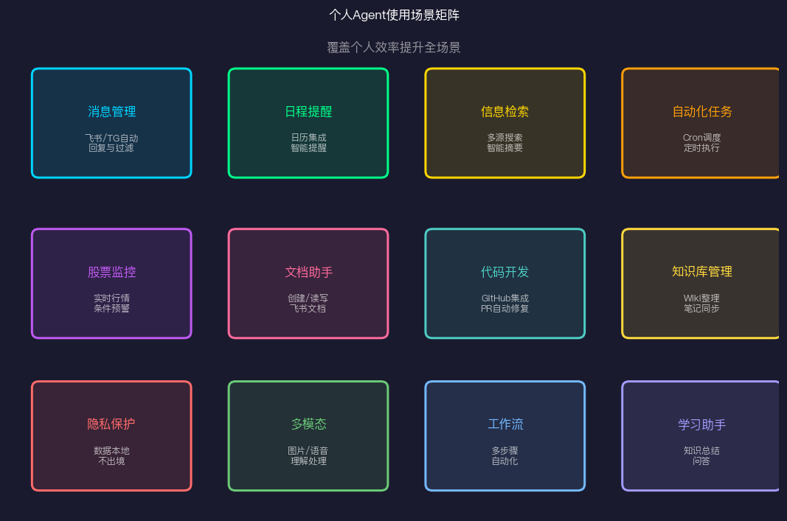
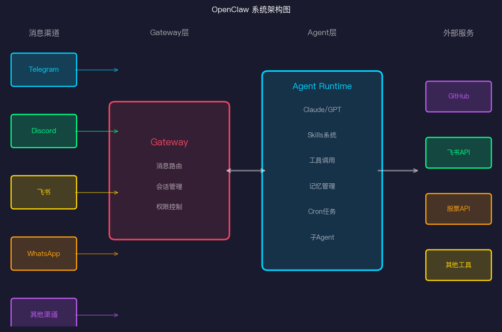
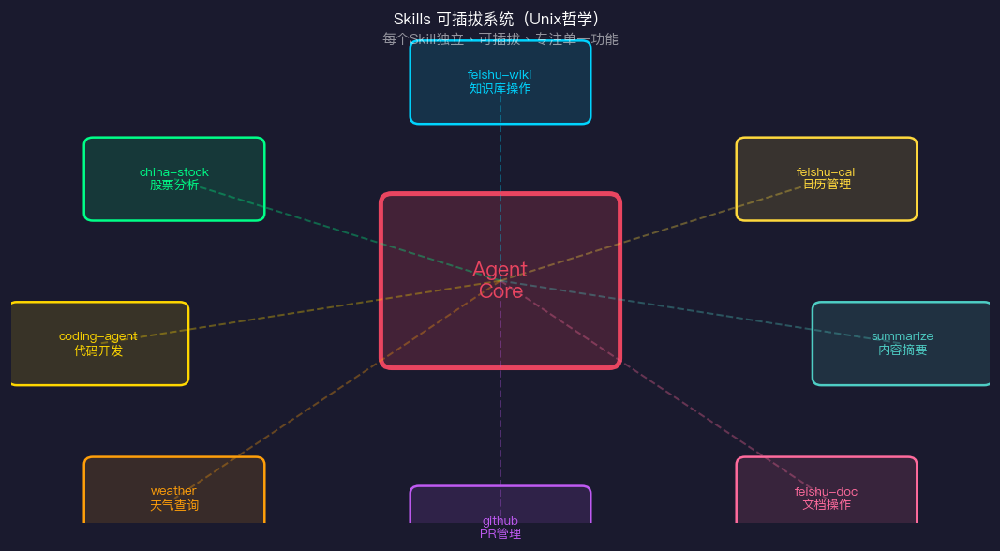
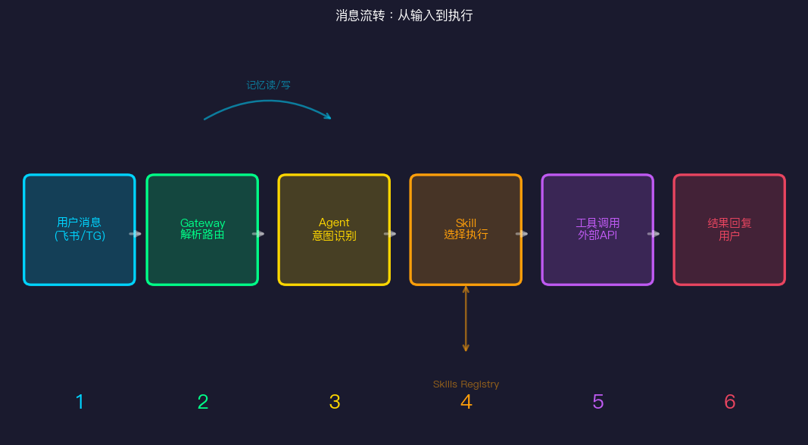

# 个人AI Agent实践：用OpenClaw打造你的私人助手

> Day 13 · AI Agent 30天系列

理论讲够了。今天聊点实际的——我自己用AI Agent做什么，怎么做的。

我用的是 **OpenClaw**，一个开源的个人AI Agent平台，跑在自己的机器上，连接Telegram、飞书、Discord等渠道，可以随时唤醒我的AI助手处理各种任务。已经用了几个月，它已经彻底改变了我的工作方式。

这篇文章分享OpenClaw的架构设计、核心设计理念，以及三个我实际在用的Agent案例。

---

## 个人Agent：你真正需要什么

在开始之前，先想清楚个人Agent应该解决什么问题。

不同于企业Agent聚焦流程自动化，个人Agent面对的是**个人效率**的碎片化问题：

**消息过载**：每天几十上百条消息，哪些重要？哪些可以延后？哪些根本不用回？

**信息噪音**：关注了100个信源，有价值的信息淹没在噪音里。

**重复操作**：每周一发日报、每天检查股票、定期整理文档。这些机械操作占用了大量时间。

**跨工具协作**：我的工作分散在GitHub、飞书、邮件、各种API里，工具之间不互通。

一个好的个人Agent，应该是你的**数字分身**——知道你的偏好，能自主处理日常事务，在需要你决策的时候才打扰你。



---

## OpenClaw架构解析



OpenClaw的架构分三层：

### Gateway层：统一消息入口

Gateway是连接外部世界和Agent内核的桥梁。它处理：

- **多渠道接入**：Telegram、Discord、飞书、WhatsApp等，你可以在任何渠道唤醒Agent
- **消息路由**：根据消息来源、内容、上下文决定发给哪个Agent处理
- **会话管理**：维护对话上下文，支持多轮对话
- **权限控制**：谁可以给Agent发指令（比如我设置了只听从自己的飞书账号）

Gateway的设计让你不被绑定在特定平台。你可以今天用Telegram，明天改用飞书，Agent的核心逻辑完全不变。

### Agent Runtime层：大脑

这是Agent的核心。运行时包含：

- **LLM引擎**：对接Claude、GPT等模型，支持快速切换
- **Skills系统**：可插拔的技能模块（后面重点讲）
- **工具调用**：统一的工具调用框架，支持并发执行
- **记忆管理**：分日记忆和长期记忆，让Agent记住你的偏好和历史
- **Cron调度**：定时任务，无需你触发的自主行动
- **子Agent系统**：复杂任务可以派发给专属子Agent并发处理

### 外部服务层：手脚

Agent通过外部服务层与世界交互：GitHub、飞书API、股票API、各种第三方工具。每个工具的调用都经过统一的安全层。

---

## 核心设计理念：Skills可插拔系统

OpenClaw最令我欣赏的设计是 **Skills系统**。



**Unix哲学**：每个Skill只做一件事，做好它。Skills之间通过标准接口组合，形成复杂能力。

一个Skill的结构很简单：

```
skills/
  feishu-doc/
    SKILL.md      ← 技能描述和使用说明
    tools.py      ← 工具实现
    config.yaml   ← 配置
```

`SKILL.md` 就是这个Skill的"说明书"，Agent在需要时读取它，知道这个Skill能做什么、怎么用。

这个设计有几个好处：

1. **按需加载**：Agent不需要把所有功能都加载进上下文，节省Token
2. **独立演化**：每个Skill可以独立更新，不影响其他功能
3. **社区共享**：你写了一个好的Skill，可以发布给其他人用
4. **渐进扩展**：从几个基础Skill开始，随用随扩展

截至写这篇文章，我的OpenClaw装了30+个Skills，但日常最常用的只有10个左右。

**"文件即记忆"原则**

OpenClaw的另一个设计哲学：用文件作为Agent的记忆存储。

```
memory/
  2026-03-14.md     ← 今天发生了什么
  2026-03-13.md     ← 昨天
  heartbeat-state.json  ← 定时检查状态
MEMORY.md           ← 长期记忆（精华）
USER.md             ← 关于用户的画像
```

每次Agent做了重要的事、学到新信息，都写入对应文件。下次Session加载这些文件，就恢复了"记忆"。

这比复杂的向量数据库更简单，也更透明——你可以直接读写这些文件，完全掌控Agent的记忆。

---

## 消息流转：从你的消息到Agent的行动



当你发一条消息给Agent，背后发生的是：

1. **渠道接收**：飞书/Telegram/Discord的插件收到消息
2. **Gateway解析**：判断是哪个用户、哪个会话、什么类型的请求
3. **意图识别**：Agent分析你想要什么，是否需要查看历史上下文
4. **Skill选择**：决定调用哪个Skill来处理这个请求
5. **工具执行**：Skill调用具体工具（可能并发执行多个）
6. **结果整合**：把工具返回的结果整合成自然语言回复

整个过程通常在5-10秒完成。对于复杂任务，Agent会先报告"我在处理中"，避免用户以为没反应。

---

## 实战案例1：股票监控Agent

这是我最早做的一个案例，也是让我最直观感受到"Agent价值"的案例。

**场景**：我关注十几只A股和港股，每天需要：
- 检查关注股票的涨跌
- 当触发特定条件时（如跌幅超5%）及时提醒
- 每周生成一份持仓分析报告

**之前的方式**：打开各种App手动查，或者写脚本自动推送但没有上下文分析。

**Agent方案**：

```yaml
# cron_jobs.yaml
- name: stock_morning_check
  schedule: "0 9 * * 1-5"   # 工作日9点
  prompt: |
    检查我的关注列表股票（见WATCHLIST.md）的开盘情况，
    如果有任何股票涨跌超3%，立即推送飞书提醒。
    否则发一份简短的市场情绪摘要。

- name: stock_weekly_report  
  schedule: "0 18 * * 5"    # 周五18点
  prompt: |
    生成本周股票分析报告，包括：
    1. 本周涨跌最大的5只股票
    2. 结合财经新闻分析可能原因
    3. 下周需要重点关注的事件
    推送到飞书个人对话。
```

```python
# skills/china-stock-analysis/tools.py
import akshare as ak

async def get_stock_data(symbol: str, period: str = "daily") -> dict:
    """获取股票行情数据"""
    df = ak.stock_zh_a_hist(symbol=symbol, period=period, adjust="qfq")
    latest = df.iloc[-1]
    return {
        "symbol": symbol,
        "price": latest["收盘"],
        "change_pct": latest["涨跌幅"],
        "volume": latest["成交量"],
        "date": latest["日期"].strftime("%Y-%m-%d"),
    }

async def analyze_stock(symbol: str) -> str:
    """分析股票基本面"""
    data = await get_stock_data(symbol)
    news = await get_latest_news(symbol)
    
    prompt = f"""
    股票 {symbol} 数据：{data}
    最新相关新闻：{news}
    
    请从价值投资角度简要分析该股票当前状态，
    重点关注：估值、趋势、风险点。100字以内。
    """
    return await llm.complete(prompt)
```

**实际效果**：
- 每天自动推送市场摘要，有异常立即提醒
- 再也不用主动去查，有重要信号自然弹出来
- 每周报告比我自己手动整理更全面

这个案例的关键是：Agent不只是数据推送，而是加入了**分析和上下文**。原始数据我自己能看，我需要的是"解读"。

---

## 实战案例2：飞书文档Agent

我在字节跳动工作，飞书文档是日常工具。之前很多文档管理工作是手动的——创建文档、整理结构、查找内容。

**Agent接管的任务**：

**1. 会议纪要自动整理**

```python
# 在飞书群里 @Agent "帮我整理今天的会议纪要"
async def create_meeting_notes(meeting_content: str, attendees: list):
    # 用LLM结构化会议内容
    structured = await llm.complete(f"""
    将以下会议内容整理为标准会议纪要格式：
    - 会议主题
    - 与会人员  
    - 主要讨论内容（要点列表）
    - 决策事项
    - 后续行动（责任人+截止日期）
    
    原始内容：{meeting_content}
    """)
    
    # 创建飞书文档
    doc = await feishu_doc.create(
        title=f"会议纪要 {datetime.today().strftime('%Y-%m-%d')}",
        content=structured,
        folder="会议记录/"
    )
    
    # 分享给与会人
    for attendee in attendees:
        await feishu_doc.share(doc.id, user=attendee, role="viewer")
    
    return doc.url
```

**2. 知识库搜索和整理**

```
我：帮我找所有关于"推荐系统"的文档，整理成一个索引页面

Agent：我找到了23篇相关文档，帮你整理了一个结构化索引：

## 推荐系统文档索引
### 基础原理（5篇）
- [协同过滤算法详解](link) - 2024-01
- [内容召回方案](link) - 2024-02

### 工程实践（8篇）
- [在线服务架构](link) - 2024-03
...

已创建索引文档：[推荐系统知识库索引](link)
```

这个案例展示了Agent的价值：不是帮你做全新的事，而是**把你已经在做的事做得更快更好**。

---

## 实战案例3：代码开发Agent

这是最强大也最需要谨慎的案例——让Agent参与实际的代码开发。

**我的配置**：

```yaml
# coding_agent_config.yaml
permissions:
  read_files: true
  write_files: true        # 允许修改代码
  git_commit: false        # 不允许直接提交
  create_pr: true          # 允许创建PR（需要人工merge）
  run_tests: true          # 允许运行测试

review_required:
  - "*.sql"                # SQL修改必须人工审查
  - "config/*.yaml"        # 配置文件变更必须审查
  - "migrations/*"         # 数据库迁移必须审查
```

**实际工作流**：

1. **Bug修复助手**：

```
我：GitHub issue #234 说用户上传图片有时会失败，帮我看看

Agent：我查看了issue #234和相关代码：
- image_processor.py 第89行在文件大于10MB时有竞态条件
- 建议修复：添加文件大小检查和互斥锁
- 已创建PR #567，包含修复代码和单元测试
  请review: github.com/xxx/xxx/pull/567
```

2. **代码审查助手**：

```
我：帮我review一下今天的PR

Agent：我查看了今天的5个PR：
- PR #560: ✅ 代码质量好，逻辑清晰，建议直接merge
- PR #561: ⚠️ 有潜在的SQL注入风险，建议在第23行添加参数化查询
- PR #562: ❌ 测试覆盖率不足，缺少边界情况测试
- PR #563: ✅ minor fix，可以merge
- PR #564: ⚠️ 这个改动可能影响xxx模块，建议先讨论架构再实现
```

**安全边界很重要**：我的coding Agent只能创建PR，不能直接merge。关键配置文件、数据库相关代码，必须我亲自review。这不是不信任Agent的能力，而是这类变更的风险足够高，值得花人工的时间。

---

## 个人Agent的隐私和安全考量

把自己的数据交给Agent，安全是头等大事。

**数据不出境原则**：我的OpenClaw跑在本地MacBook上，所有记忆文件都在本地。需要处理敏感信息时，可以路由到本地模型（Ollama）而非云端API。

**权限最小化**：每个Skill都有明确的权限声明，Agent不会随意访问未授权的系统。

**操作审计**：所有操作都记录在日志里，我可以随时查看Agent做了什么。

**敏感信息脱敏**：在任何需要发给LLM API处理的内容里，个人隐私信息（身份证、银行卡、密码）自动脱敏。

**我的原则**：对外发送的操作（发消息、发邮件、社交媒体发布），一律需要我明确确认。内部操作（整理文件、创建草稿、分析数据）可以自动执行。

---

## 如何开始

如果你想搭建自己的个人Agent，最小成本的起步方式：

**第一步（1天）**：
- 安装OpenClaw
- 连接一个渠道（Telegram最简单）
- 用基础对话功能感受一下

**第二步（一周）**：
- 找到你生活中最痛的重复性任务
- 写一个简单的Skill来解决它
- 配置一个定时任务

**第三步（持续）**：
- 根据实际使用情况增加Skills
- 调整记忆和偏好文件
- 让Agent越来越了解你

关键是**从小开始，解决真实问题**。不要一开始就想着做一个全能助手，那样很容易放弃。先做一件事，做好了再加下一件。

---

## 参考资料

- [OpenClaw GitHub](https://github.com/openclaw/openclaw) 
- [OpenClaw文档](https://docs.openclaw.io)
- [AK Share - A股数据获取库](https://akshare.akfamily.xyz/)
- [Ollama - 本地运行LLM](https://ollama.ai/)
- [飞书开放平台文档](https://open.feishu.cn/document/)
- [Building a Second Brain - Tiago Forte](https://fortelabs.com/blog/basboverview/)
- [Personal Knowledge Management with AI](https://maggieappleton.com/ai-garden)
- [Unix Philosophy](https://en.wikipedia.org/wiki/Unix_philosophy)
